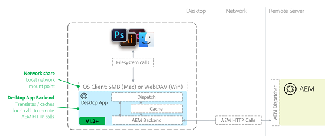

# Bonnes pratiques relatives à l’application de bureau AEM v1.10 {#aem-desktop-app-best-practices}

## Présentation {#overview}

[!DNL Adobe Experience Manager]’application de bureau relie votre solution de gestion des ressources numériques (DAM) à votre bureau, ce qui vous permet d’ouvrir les fichiers disponibles dans l’interface utilisateur web d’AEM directement sur le bureau. Si vous avez enregistré une ressource à partir du bureau, elle est téléchargée dans AEM à l’emplacement approprié.

L’application de bureau AEM élimine les risques de mettre à jour des copies locales incorrectes ou de mettre à jour une ressource incorrecte dans AEM. Le workflow convivial de l’appli de bureau est activé à l’aide de la technologie de partage réseau fournie par les systèmes d’exploitation de bureau.

L’application de bureau monte le référentiel AEM Assets en tant que partage réseau sur le bureau. Par conséquent, les dossiers et les fichiers apparaissent comme s’ils étaient locaux. Toutefois, il n’est pas recommandé d’effectuer des opérations de gestion des ressources numériques directement à partir du bureau dans le partage réseau monté dans le Finder ou l’Explorateur. Adobe vous recommande plutôt d’utiliser l’interface utilisateur web d’AEM Assets pour effectuer des opérations, telles que copier ou déplacer un grand nombre de ressources.

>[!NOTE]
>
>Avant de lire ce document, vous pouvez consulter les [bonnes pratiques générales d’intégration d’AEM et de Creative Cloud](https://experienceleague.adobe.com/fr/docs/experience-manager-65/content/assets/administer/aem-cc-integration-best-practices) pour obtenir une meilleure vue d’ensemble du sujet.

## Architecture de l’application de bureau AEM {#aem-desktop-app-architecture}

L’appli de bureau AEM utilise des partages réseau WebDAV (Windows) ou SMB (Mac) pour monter des partages réseau. Le partage réseau monté est uniquement local. L’appli de bureau AEM intercepte les appels (ouverture, lecture, écriture) et fournit une mise en cache locale supplémentaire. Elle convertit les appels distants au serveur AEM Assets en requêtes HTTP AEM optimisées. Le diagramme suivant illustre l’architecture de l’appli de bureau AEM.

*Figure : Architecture de l’appli de bureau AEM*

Lorsqu’un fichier est enregistré, la mise en cache supplémentaire à l’écriture garantit qu’il est d’abord stocké localement, ce qui permet à l’utilisateur d’éviter d’attendre le transfert réseau. Ensuite, après un délai prédéfini (30 secondes), le fichier est chargé vers AEM en arrière-plan, puis la ressource est chargée dans AEM. L’appli de bureau AEM fournit une interface utilisateur permettant de surveiller le statut des téléchargements de fichiers en arrière-plan.

## Utilisation recommandée de l’application de bureau AEM {#recommended-use-of-aem-desktop-app}

Les fonctionnalités clés de l’application de bureau AEM sont les suivantes :

* **Ouverture de fichiers depuis l’interface utilisateur web d’AEM Assets sur le bureau**. Dans l’interface utilisateur web, vous pouvez afficher des ressources sur le bureau (dans le Finder, l’Explorateur) ou ouvrir une ressource à l’aide d’une application de bureau.

* **Extraire et enregistrer**. Assets peut être extrait pour modification ; il est marqué comme verrouillé pour l’utilisateur dans AEM Assets. Après la modification, la ressource peut être archivée pour la déverrouiller.

* **Enregistrez les modifications dans les fichiers**. Toute modification que vous enregistrez dans le fichier du partage réseau est automatiquement téléchargée vers AEM et une nouvelle version est créée.

* **Placez les ressources liées dans d’autres documents**. Dans les applications, telles que Creative Cloud ([!DNL Adobe Photoshop], [!DNL Adobe InDesign] et [!DNL Adobe Illustrator]), vous pouvez placer un fichier externe en tant que lien. Par exemple, vous pouvez placer une image dans un document InDesign. Dans ce cas, le montage Partage réseau vous permet de parcourir et de sélectionner des ressources d’AEM à des fins d’emplacement. Le placement des fichiers liés fonctionne également dans certaines applications non Adobe, telles que MS® Office.

* **Résolution des références dans AEM**. Si les fichiers placés et les fichiers principaux avec un lien sont stockés dans AEM, il peut automatiquement fournir des informations côté serveur sur les références des ressources.

* **Accédez à la ressource à partir du bureau**. Dans le partage réseau monté, un menu contextuel fournit une boîte de dialogue [!UICONTROL More Info] (aperçu plus grand, métadonnées clés) et la possibilité d’ouvrir une ressource dans l’interface utilisateur d’AEM.

* **Chargement en bloc de dossiers hiérarchiques volumineux**. Si vous utilisez l’option **Créer** > **Chargement de dossier** dans l’interface utilisateur d’AEM pour charger des ressources, l’application de bureau AEM charge la hiérarchie de dossiers sélectionnée dans AEM en arrière-plan. La progression du chargement est surveillée par une interface utilisateur dédiée dans l’application de bureau .

## Utilisation inappropriée de l’application de bureau AEM {#inappropriate-use-of-aem-desktop-app}

* N’utilisez pas l’application de bureau AEM pour gérer les ressources à partir de l’ordinateur de bureau. L’appli de bureau AEM n’a pas été conçue pour remplacer les lecteurs réseau. Utilisez à la place les fonctionnalités suivantes :

   * Interface utilisateur web d’AEM Assets pour la gestion des ressources numériques (recherche ou partage de ressources, métadonnées, copie ou déplacement).

   * L’option [!UICONTROL Folder Upload] (Chargement de dossiers) de l’appli de bureau AEM pour charger des dossiers hiérarchiques volumineux.

* Ne traitez pas l’application de bureau AEM comme un client de « synchronisation de bureau » pour AEM Assets. Le principal avantage de l’appli de bureau AEM est qu’elle fournit un accès « virtuel » à l’ensemble du référentiel, et les applications de synchronisation du bureau ne synchronisent généralement que les ressources appartenant à un utilisateur. L’application de bureau AEM fournit un certain niveau de mise en cache et de chargement en arrière-plan ; son fonctionnement est toujours très différent des applications « Sync » standard, telles que l’application de bureau Adobe Creative Cloud ou Microsoft OneDrive.

* N’utilisez pas les lecteurs réseau de l’appli de bureau AEM pour enregistrer fréquemment les ressources. Toutes les opérations de sauvegarde sont transmises à AEM Assets. Par conséquent, il n’est pas pratique d’effectuer des opérations de modification intensives directement dans le référentiel AEM Assets monté. La modification d’une ressource directement dans le référentiel monté encombre la chronologie de la ressource avec des versions non pertinentes et impose des surcharges supplémentaires sur le serveur.

* N’utilisez pas l’appli de bureau AEM pour faire migrer de grandes quantités de données d’une instance AEM vers une autre. Voir le [Guide de migration](https://experienceleague.adobe.com/en/docs/experience-manager-65/content/assets/administer/assets-migration-guide) pour planifier et exécuter des migrations de ressources. En revanche, l’application de bureau [prend en charge le chargement en masse](use-app-v1.md#bulkupload) un grand nombre de ressources pour la première fois en [!DNL Adobe Experience Manager].

## Recommandations pour des cas d’utilisation spécifiques {#recommendations-for-selected-use-cases}

### Accès aux ressources pour les utilisateurs et utilisatrices créatifs {#access-to-assets-for-creative-users}

L’appli de bureau AEM fournit un accès virtuel à l’ensemble du référentiel DAM, mais il peut être compliqué pour les utilisateurs créatifs de trouver et d’accéder aux ressources appropriées sur leur bureau. Utilisez ces bonnes pratiques pour simplifier cette opération.

* Utilisez les fonctions de collaboration de l’UI web d’AEM Assets pour offrir aux utilisateurs et utilisatrices créatifs un accès plus direct aux ressources appropriées. Le partage de dossiers ou de collections, la diffusion de collections dynamiques (recherches enregistrées) ou l’envoi de notifications avec des pointeurs vers les ressources appropriées sont quelques exemples de fonctionnalités de collaboration. Les utilisateurs de Creative peuvent ensuite utiliser des actions de bureau dans l’interface utilisateur web pour accéder rapidement à ces ressources sur leur bureau.

* Tenez compte des autorisations appropriées relatives aux ressources (contrôle d’accès) afin de simplifier l’affichage dans le référentiel DAM pour les utilisateurs créatifs, en limitant essentiellement leur accès aux seules ressources dont ils ont besoin.

   * Certaines zones non pertinentes pour les utilisateurs créatifs peuvent ne pas être autorisées pour leurs groupes d’utilisateurs, et supprimées de l’affichage, également sur le bureau.

   * La plupart des ressources de la gestion des ressources numériques (DAM) sont finales et ne sont pas censées être modifiées. Ces ressources doivent être en lecture seule pour les utilisateurs créatifs.

   * Seules les ressources nécessitant des modifications ou des retouches doivent être activées pour l’écriture pour les utilisateurs créatifs. Certaines organisations utilisent des projets AEM et les dossiers qu’ils créent pour héberger les ressources qui font toujours l’objet de modifications.

### Recherche de ressources {#searching-assets}

Pour rechercher un fichier que vous souhaitez ouvrir sur le bureau :

* Utilisez l’interface utilisateur web d’AEM Assets pour localiser la ressource. Non seulement la recherche dans AEM Assets est puissante (facettes de recherche, recherches enregistrées), mais elle fournit également des fonctionnalités supplémentaires pour trouver la ressource appropriée. Il s’agit notamment de filtres supplémentaires, comme la possibilité de rechercher des ressources en fonction de leur statut (approbation, expiration), des collections, des tâches, des notifications et du partage de dossiers/collections avec d’autres utilisateurs/groupes.

* Une fois la ressource localisée, utilisez les actions de bureau dans l’interface utilisateur d’AEM pour accéder à la ressource sur le bureau.

### Mise à jour des ressources ouvertes à l’aide de l’application de bureau AEM {#updating-assets-opened-using-aem-desktop-app}

Si vous modifiez une ressource directement à l’emplacement mappé depuis AEM Assets vers un partage réseau local, la ressource est téléchargée sur AEM chaque fois que vous l’enregistrez sur le bureau. En outre, AEM crée une version et génère des rendus.

Si une ressource stockée dans AEM doit être mise à jour :

* Pour les **mises à jour mineures**, telles que les demandes de retouche mineures du processus d’approbation :

   * Extrayez le fichier et ouvrez-le sur le bureau.

   * Mettez-le à jour.

   * Enregistrez la version mise à jour. La ressource est mise à jour et la chronologie affiche la version d’origine à des fins de comparaison.

* Pour les **mises à jour majeures**, telles qu’une demande de modification nécessitant un petit cycle créatif de travaux en cours :

   * Utilisez l’option Afficher pour ouvrir le dossier approprié sur le bureau.

   * Copiez le fichier dans un dossier de travail en cours en dehors du partage AEM Assets mappé (par exemple, copiez le fichier dans un dossier synchronisé avec l’appli de bureau Adobe Creative Cloud).

   * Travaillez sur le fichier et enregistrez-le par intermittence. Les modifications ne sont pas enregistrées dans AEM Assets.

   * Une fois les modifications terminées, déplacez, copiez ou enregistrez le fichier mappé à partir d’AEM pour le charger en tant que nouvelle version.

## Performances du réseau {#network-performance}

Une bonne expérience utilisateur de l’application de bureau AEM repose sur une connectivité réseau stable et un serveur bien réglé, en particulier pour le chargement et la mise à jour de ressources. Ces recommandations s’appliquent aux équipes réseau/informatiques des organisations.

### Remarques relatives au réseau {#network-considerations}

Pour connaître les bonnes pratiques relatives à la configuration réseau d’AEM Assets, consultez le document [Comment migrer des ressources en bloc](https://experienceleague.adobe.com/en/docs/experience-manager-65/content/assets/administer/assets-migration-guide) . Voici quelques-uns des aspects importants permettant d’optimiser l’expérience de l’application de bureau AEM pour les utilisateurs et utilisatrices :

* **Utilisez un Dispatcher correctement configuré**. Utilisez le Dispatcher AEM pour plus de sécurité et assurez-vous qu’il est configuré pour la [connexion de l’application de bureau AEM à AEM derrière un Dispatcher](install-configure-app-v1.md#connect-to-an-aem-instance-behind-a-dispatcher)

* **Économisez de la bande passante**. Envisagez de désactiver l’aperçu des icônes dans le Finder sur Mac lorsque vous parcourez le référentiel monté à l’aide du Finder. L’outil de recherche demande à chaque fichier de générer un aperçu et entraîne le téléchargement et la mise en cache locale de la ressource par l’application de bureau . Tout en économisant de la bande passante, cela réduit également l’expérience utilisateur sur le bureau. Cela doit donc être fait lorsque vous travaillez sur des référentiels avec des ressources volumineuses ou une bande passante limitée.

>[!NOTE]
>
>Pour désactiver les aperçus d’icônes, dans le Finder, accédez à [!UICONTROL View], sélectionnez [!UICONTROL View Options], puis désélectionnez l’option [!UICONTROL Show icon preview]. Cette opération ne fonctionne que pour le dossier actuel. Pour en faire une option par défaut, cliquez sur l’option [!UICONTROL Use as default] dans la même boîte de dialogue.

### Optimisation des performances du serveur {#optimizing-server-performance}

Pour comprendre comment le serveur AEM Assets doit être optimisé en termes de performances, consultez le [Guide d’optimisation des performances d’AEM Assets](https://experienceleague.adobe.com/fr/docs/experience-manager-65/content/assets/administer/performance-tuning-guidelines). Certains aspects importants relatifs aux performances du serveur pour l’appli de bureau AEM concernent l’optimisation de la configuration des workflows afin d’assurer un bon fonctionnement en vue du chargement des ressources :

* **Chargement de ressources plus performant**. Configurez le modèle de workflow [Mise à jour des ressources AEM comme transitoire](https://experienceleague.adobe.com/fr/docs/experience-manager-65/content/assets/administer/performance-tuning-guidelines).

* **Limitation du serveur CPU pour les chargements**. Assurez-vous que le paramètre Nombre maximal de tâches de workflow parallèles est correctement défini, de sorte que les chargements n’épuisent pas tous les CPU.
