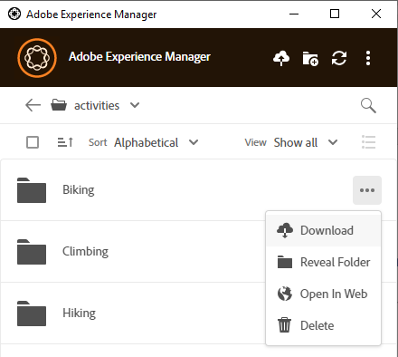
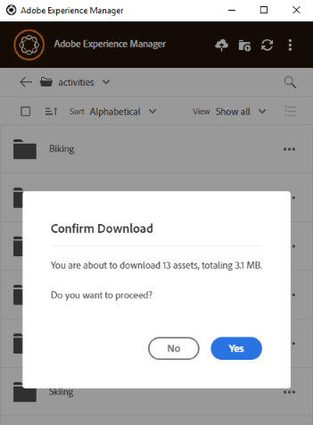

# Téléchargement local de ressources {#download-assets-locally}

L’application télécharge fréquemment les ressources du serveur [!DNL Experience Manager] vers votre système de fichiers local. Les téléchargements consomment de la bande passante et de l’espace disque. Connaître les scénarios peut vous aider à optimiser le temps d’attente avant la fin des téléchargements. Vous pouvez télécharger les ressources sur votre système de fichiers local. L’application récupère les ressources à partir du serveur [!DNL Experience Manager] et enregistre la même copie sur votre système de fichiers local.

Cliquez sur **[!UICONTROL More actions]**  pour afficher les options, puis sur  pour les télécharger.

>[!NOTE]
>
>Lors du téléchargement ou du chargement d’un fichier volumineux ou de plusieurs fichiers, l’application désactive les actions sur les ressources et les dossiers. Les actions sont disponibles lorsque le téléchargement ou le chargement est terminé.

Lorsque vous utilisez l’action [!UICONTROL Open] pour ouvrir une ressource dans une application de bureau native, la ressource est téléchargée localement si elle n’est pas déjà disponible localement. Voir [Ouverture de ressources](#openondesktop-v2).

Lorsque vous affichez l’emplacement d’une ressource ou d’un dossier depuis l’application, la ressource ou le dossier est d’abord téléchargé localement, puis ouvert sur votre ordinateur dans le partage réseau local. Voir [Ouverture de ressources](#openondesktop-v2).

Lorsque vous utilisez l’action [!UICONTROL Edit] pour modifier une ressource dans une application de bureau native, la ressource est téléchargée localement si elle n’est pas déjà disponible localement. Reportez-vous à [Modification de ressources et chargement de ressources mises à jour dans [!DNL Experience Manager]](#edit-assets-upload-updated-assets).

Si l’application est installée et autorisée à le faire, elle effectue les actions lorsque vous utilisez des [!UICONTROL Desktop Actions] provenant de [!DNL Experience Manager]’interface web d’. L’application télécharge d’abord la ressource, puis termine l’action.

## Téléchargement de plusieurs ressources {#download-multiple-assets}

Le téléchargement de plusieurs ressources peut entraîner de faibles performances si la taille de la file d’attente est importante ou si vous rencontrez des problèmes réseau. En outre, vous pouvez sans le savoir placer en file d’attente de nombreuses ressources à télécharger lorsque vous téléchargez un dossier. Pour éviter de longs temps d’attente, l’application limite le nombre de ressources téléchargées en une seule fois. Pour savoir comment configurer cette fonctionnalité, voir [Définition des préférences](install-upgrade.md#set-preferences). Même en dessous de cette limite, l’application peut parfois rechercher une confirmation avant de télécharger un dossier apparemment volumineux.

Si des dossiers sont sélectionnés et téléchargés, l’application télécharge uniquement les ressources stockées directement dans les dossiers de [!DNL Experience Manager]. Elle ne télécharge pas automatiquement les ressources des sous-dossiers.

## Étapes suivantes {#next-steps}

* [Regardez une vidéo pour commencer à utiliser l’application de bureau Adobe Experience Manager .](https://experienceleague.adobe.com/en/docs/experience-manager-learn/assets/creative-workflows/aem-desktop-app)

* Faites des commentaires sur la documentation en utilisant [!UICONTROL Edit this page]  ou [!UICONTROL Log an issue]  disponible dans la barre latérale droite.

* Contactez l’[assistance clientèle](https://experienceleague.adobe.com/fr?support-solution=General#support).

>[!MORELIKETHIS]
>
>* [Chargement des ressources](/help/using/upload-assets.md)
>* [Comprendre l’interface utilisateur](/help/using/user-interface.md)
>* [Recherche](/help/using/search.md)
