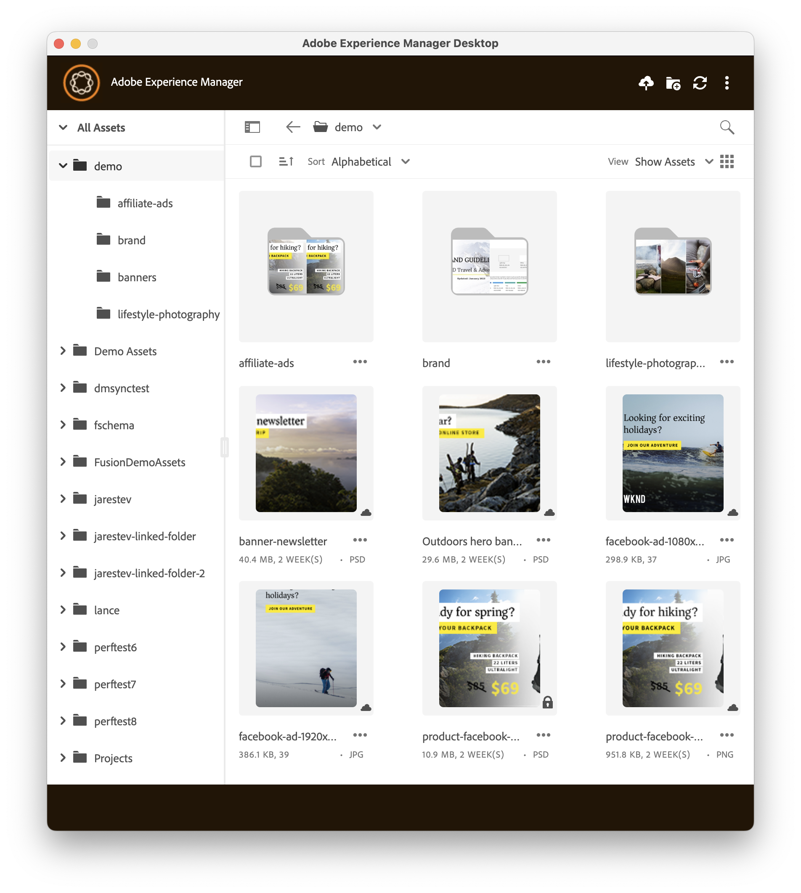

# Notes de mise à jour de l’application de bureau [!DNL Adobe Experience Manager] {#release-notes-v2}

La date de publication de l’appli de bureau version 3.0.1 est le 18 décembre 2025.  Cette version comprend les améliorations suivantes :

**Workflows plus fluides et plus fiables**

* Attribution d’un nom cohérent aux dossiers en résolvant les problèmes de synchronisation entre l’application de bureau AEM et l’auteur AEM.
* Activation de workflows ininterrompus en autorisant des fonctionnalités d’application complètes pendant les opérations de transfert actives
* Amélioration de la fiabilité de la page des propriétés du dossier, permettant un accès cohérent aux métadonnées et aux paramètres du dossier.

**Expérience utilisateur plus rapide et plus réactive**

* Amélioration de la réactivité de l’interface utilisateur en remplaçant les E/S bloquantes par un traitement asynchrone, ce qui offre une expérience plus fluide lors des opérations à forte charge.
* Amélioration des transferts de fichiers volumineux en introduisant la pagination dans les flux de chargement et de téléchargement, ce qui permet une gestion efficace des jeux de données volumineux.

**Stabilité et fiabilité renforcées**

* Résolution du redémarrage du serveur de création déclenché par les interactions de l’application de bureau, ce qui améliore considérablement la stabilité du système.
* L’application gérée plante lors du téléchargement ou du chargement d’un dossier volumineux (des milliers de fichiers).

Les **versions de [!DNL Experience Manager] prises en charge** sont les suivantes :

* [!DNL Experience Manager] as a [!DNL Cloud Service]. Voir les [notes de mise à jour](https://experienceleague.adobe.com/fr/docs/experience-manager-cloud-service/content/release-notes/home).
* [!DNL Experience Manager] 6.5.0 ou version ultérieure, sur Adobe Managed Services (AMS) ou On-Premise. Consultez les [notes de mise à jour du Service Pack](https://experienceleague.adobe.com/fr/docs/experience-manager-65/content/release-notes/release-notes).

L’appli de bureau [!DNL Adobe Experience Manager] est disponible avec les **systèmes d’exploitation** suivants :

* macOS X 10.14 ou version ultérieure, avec les correctifs de bogues les plus récents.
* Windows 10 avec les derniers Service Packs et correctifs.

Deux versions du programme d’installation de Windows sont disponibles pour l’application de bureau AEM version 2.3.1 et versions ultérieures. Le programme d’installation de base installe l’application de bureau AEM sous le répertoire local de données d’application de l’utilisateur. Adobe recommande ce processus d’installation à la plupart de ses utilisateurs. Un programme d’installation d’Enterprise Windows est également disponible, qui installe l’application de bureau AEM dans le répertoire des fichiers programme partagés. Ces deux programmes d’installation installent la même version de l’application de bureau AEM, sans aucune différence de fonctionnalité.

Les **URL de téléchargement** pour les systèmes d’exploitation pris en charge sont les suivantes :

| Système d’exploitation | [!DNL Experience Manager] as a [!DNL Cloud Service] | [!DNL Experience Manager] 6.x |
|---|---|---|
| macOS (v3.0.1) | [Lien de téléchargement](https://experience.adobe.com/#/downloads/content/software-distribution/en/aemcloud.html?package=/content/software-distribution/en/details.html/content/dam/aemcloud/public/aem-desktop-app/aem-desktop-osx-x64-3.0.1.dmg) | [Lien de téléchargement](https://experience.adobe.com/#/downloads/content/software-distribution/en/aem.html?package=/content/software-distribution/en/details.html/content/dam/aem/public/adobe/packages/adobe/aem-desktop-app/aem-desktop-osx-x64-3.0.1.dmg) |
| macOS Apple Silicon (M1) (v3.0.1) | [Lien de téléchargement](https://experience.adobe.com/#/downloads/content/software-distribution/en/aemcloud.html?package=/content/software-distribution/en/details.html/content/dam/aemcloud/public/aem-desktop-app/aem-desktop-osx-arm64-3.0.1.dmg) | [Lien de téléchargement](https://experience.adobe.com/#/downloads/content/software-distribution/en/aem.html?package=/content/software-distribution/en/details.html/content/dam/aem/public/adobe/packages/adobe/aem-desktop-app/aem-desktop-osx-arm64-3.0.1.dmg) |
| Windows 64 bits (v3.0.1) | [Lien de téléchargement](https://experience.adobe.com/#/downloads/content/software-distribution/en/aemcloud.html?package=/content/software-distribution/en/details.html/content/dam/aemcloud/public/aem-desktop-app/aem-desktop-win-x64-3.0.1.exe) | [Lien de téléchargement](https://experience.adobe.com/#/downloads/content/software-distribution/en/aem.html?package=/content/software-distribution/en/details.html/content/dam/aem/public/adobe/packages/adobe/aem-desktop-app/aem-desktop-win-x64-3.0.1.exe) |
| Windows 64 bits Entreprise (v3.0.1) | [Lien de téléchargement](https://experience.adobe.com/#/downloads/content/software-distribution/en/aemcloud.html?package=/content/software-distribution/en/details.html/content/dam/aemcloud/public/aem-desktop-app/aem-desktop-win-x64-ent-3.0.1.msi) | [Lien de téléchargement](https://experience.adobe.com/#/downloads/content/software-distribution/en/aem.html?package=/content/software-distribution/en/details.html/content/dam/aem/public/adobe/packages/adobe/aem-desktop-app/aem-desktop-win-x64-ent-3.0.1.msi) |
| macOS (v3.0.0) | [Lien de téléchargement](https://experience.adobe.com/#/downloads/content/software-distribution/en/aemcloud.html?package=/content/software-distribution/en/details.html/content/dam/aemcloud/public/aem-desktop-app/aem-desktop-osx-x64-3.0.0.dmg) | [Lien de téléchargement](https://experience.adobe.com/#/downloads/content/software-distribution/en/aem.html?package=/content/software-distribution/en/details.html/content/dam/aem/public/adobe/packages/adobe/aem-desktop-app/aem-desktop-osx-x64-3.0.0.dmg) |
| macOS Apple Silicon (M1) (v3.0.0) | [Lien de téléchargement](https://experience.adobe.com/#/downloads/content/software-distribution/en/aemcloud.html?package=/content/software-distribution/en/details.html/content/dam/aemcloud/public/aem-desktop-app/aem-desktop-osx-arm64-3.0.0.dmg) | [Lien de téléchargement](https://experience.adobe.com/#/downloads/content/software-distribution/en/aem.html?package=/content/software-distribution/en/details.html/content/dam/aem/public/adobe/packages/adobe/aem-desktop-app/aem-desktop-osx-arm64-3.0.0.dmg) |
| Windows 64 bits (v3.0.0) | [Lien de téléchargement](https://experience.adobe.com/#/downloads/content/software-distribution/en/aemcloud.html?package=/content/software-distribution/en/details.html/content/dam/aemcloud/public/aem-desktop-app/aem-desktop-win-x64-3.0.0.exe) | [Lien de téléchargement](https://experience.adobe.com/#/downloads/content/software-distribution/en/aem.html?package=/content/software-distribution/en/details.html/content/dam/aem/public/adobe/packages/adobe/aem-desktop-app/aem-desktop-win-x64-3.0.0.exe) |
| Windows 64 bits Entreprise (v3.0.0) | [Lien de téléchargement](https://experience.adobe.com/#/downloads/content/software-distribution/en/aemcloud.html?package=/content/software-distribution/en/details.html/content/dam/aemcloud/public/aem-desktop-app/aem-desktop-win-x64-ent-3.0.0.msi) | [Lien de téléchargement](https://experience.adobe.com/#/downloads/content/software-distribution/en/aem.html?package=/content/software-distribution/en/details.html/content/dam/aem/public/adobe/packages/adobe/aem-desktop-app/aem-desktop-win-x64-ent-3.0.0.msi) |
| macOS (v2.3.3) | [Lien de téléchargement](https://experience.adobe.com/#/downloads/content/software-distribution/en/aemcloud.html?package=/content/software-distribution/en/details.html/content/dam/aemcloud/public/aem-desktop-app/aem-desktop-osx-x64-2.3.3.dmg) | [Lien de téléchargement](https://experience.adobe.com/#/downloads/content/software-distribution/en/aem.html?package=/content/software-distribution/en/details.html/content/dam/aem/public/adobe/packages/adobe/aem-desktop-app/aem-desktop-osx-x64-2.3.3.dmg) |
| macOS Apple Silicon (M1) (v2.3.3) | [Lien de téléchargement](https://experience.adobe.com/#/downloads/content/software-distribution/en/aemcloud.html?package=/content/software-distribution/en/details.html/content/dam/aemcloud/public/aem-desktop-app/aem-desktop-osx-arm64-2.3.3.dmg) | [Lien de téléchargement](https://experience.adobe.com/#/downloads/content/software-distribution/en/aem.html?package=/content/software-distribution/en/details.html/content/dam/aem/public/adobe/packages/adobe/aem-desktop-app/aem-desktop-osx-arm64-2.3.3.dmg) |
| Windows 64 bits (v2.3.3) | [Lien de téléchargement](https://experience.adobe.com/#/downloads/content/software-distribution/en/aemcloud.html?package=/content/software-distribution/en/details.html/content/dam/aemcloud/public/aem-desktop-app/aem-desktop-win-x64-2.3.3.exe) | [Lien de téléchargement](https://experience.adobe.com/#/downloads/content/software-distribution/en/aem.html?package=/content/software-distribution/en/details.html/content/dam/aem/public/adobe/packages/adobe/aem-desktop-app/aem-desktop-win-x64-2.3.3.exe) |
| Windows 64 bits Entreprise (v2.3.3) | [Lien de téléchargement](https://experience.adobe.com/#/downloads/content/software-distribution/en/aemcloud.html?package=/content/software-distribution/en/details.html/content/dam/aemcloud/public/aem-desktop-app/aem-desktop-win-x64-2.3.3.msi) | [Lien de téléchargement](https://experience.adobe.com/#/downloads/content/software-distribution/en/aem.html?package=/content/software-distribution/en/details.html/content/dam/aem/public/adobe/packages/adobe/aem-desktop-app/aem-desktop-win-x64-2.3.3.msi) |
| macOS (v2.3.1) | [Lien de téléchargement](https://nam04.safelinks.protection.outlook.com/?url=https%3A%2F%2Fexperience.adobe.com%2F%23%2Fdownloads%2Fcontent%2Fsoftware-distribution%2Fen%2Faemcloud.html%3Fpackage%3D%2Fcontent%2Fsoftware-distribution%2Fen%2Fdetails.html%2Fcontent%2Fdam%2Faemcloud%2Fpublic%2Faem-desktop-app%2Faem-desktop-osx-x64-2.3.1.dmg&data=05%7C02%7Canujm%40adobe.com%7Cfcf599743bd649c5cd7308dcab9ea5cd%7Cfa7b1b5a7b34438794aed2c178decee1%7C0%7C0%7C638573945081954149%7CUnknown%7CTWFpbGZsb3d8eyJWIjoiMC4wLjAwMDAiLCJQIjoiV2luMzIiLCJBTiI6Ik1haWwiLCJXVCI6Mn0%3D%7C0%7C%7C%7C&sdata=mwSX5ilZL0he2raIx8t5ecQ%2FWuizky4MpcCXX3mEN38%3D&reserved=0) | [Lien de téléchargement](https://nam04.safelinks.protection.outlook.com/?url=https%3A%2F%2Fexperience.adobe.com%2F%23%2Fdownloads%2Fcontent%2Fsoftware-distribution%2Fen%2Faem.html%3Fpackage%3D%2Fcontent%2Fsoftware-distribution%2Fen%2Fdetails.html%2Fcontent%2Fdam%2Faem%2Fpublic%2Fadobe%2Fpackages%2Fadobe%2Faem-desktop-app%2Faem-desktop-osx-x64-2.3.1.dmg&data=05%7C02%7Canujm%40adobe.com%7Cfcf599743bd649c5cd7308dcab9ea5cd%7Cfa7b1b5a7b34438794aed2c178decee1%7C0%7C0%7C638573945081981239%7CUnknown%7CTWFpbGZsb3d8eyJWIjoiMC4wLjAwMDAiLCJQIjoiV2luMzIiLCJBTiI6Ik1haWwiLCJXVCI6Mn0%3D%7C0%7C%7C%7C&sdata=LJH3OCFq7yRykN4wU8HN9%2FBXC%2BjfXLJH4QizeFZfRHE%3D&reserved=0) |
| macOS Apple Silicon (M1) (v2.3.1) | [Lien de téléchargement](https://nam04.safelinks.protection.outlook.com/?url=https%3A%2F%2Fexperience.adobe.com%2F%23%2Fdownloads%2Fcontent%2Fsoftware-distribution%2Fen%2Faemcloud.html%3Fpackage%3D%2Fcontent%2Fsoftware-distribution%2Fen%2Fdetails.html%2Fcontent%2Fdam%2Faemcloud%2Fpublic%2Faem-desktop-app%2Faem-desktop-osx-arm64-2.3.1.dmg&data=05%7C02%7Canujm%40adobe.com%7Cfcf599743bd649c5cd7308dcab9ea5cd%7Cfa7b1b5a7b34438794aed2c178decee1%7C0%7C0%7C638573945081965822%7CUnknown%7CTWFpbGZsb3d8eyJWIjoiMC4wLjAwMDAiLCJQIjoiV2luMzIiLCJBTiI6Ik1haWwiLCJXVCI6Mn0%3D%7C0%7C%7C%7C&sdata=2YENn0tDduiucogClt6aBZHDOE6dbzBdigq8VQawIO0%3D&reserved=0) | [Lien de téléchargement](https://nam04.safelinks.protection.outlook.com/?url=https%3A%2F%2Fexperience.adobe.com%2F%23%2Fdownloads%2Fcontent%2Fsoftware-distribution%2Fen%2Faem.html%3Fpackage%3D%2Fcontent%2Fsoftware-distribution%2Fen%2Fdetails.html%2Fcontent%2Fdam%2Faem%2Fpublic%2Fadobe%2Fpackages%2Fadobe%2Faem-desktop-app%2Faem-desktop-osx-arm64-2.3.1.dmg&data=05%7C02%7Canujm%40adobe.com%7Cfcf599743bd649c5cd7308dcab9ea5cd%7Cfa7b1b5a7b34438794aed2c178decee1%7C0%7C0%7C638573945081986151%7CUnknown%7CTWFpbGZsb3d8eyJWIjoiMC4wLjAwMDAiLCJQIjoiV2luMzIiLCJBTiI6Ik1haWwiLCJXVCI6Mn0%3D%7C0%7C%7C%7C&sdata=jCepldg4dMej0%2BrK2mUonXwqsWL8ksE8%2BLMSgsH9qTA%3D&reserved=0) |
| Windows 64 bits (v2.3.1) | [Lien de téléchargement](https://nam04.safelinks.protection.outlook.com/?url=https%3A%2F%2Fexperience.adobe.com%2F%23%2Fdownloads%2Fcontent%2Fsoftware-distribution%2Fen%2Faemcloud.html%3Fpackage%3D%2Fcontent%2Fsoftware-distribution%2Fen%2Fdetails.html%2Fcontent%2Fdam%2Faemcloud%2Fpublic%2Faem-desktop-app%2Faem-desktop-win-x64-2.3.1.exe&data=05%7C02%7Canujm%40adobe.com%7Cfcf599743bd649c5cd7308dcab9ea5cd%7Cfa7b1b5a7b34438794aed2c178decee1%7C0%7C0%7C638573945081970892%7CUnknown%7CTWFpbGZsb3d8eyJWIjoiMC4wLjAwMDAiLCJQIjoiV2luMzIiLCJBTiI6Ik1haWwiLCJXVCI6Mn0%3D%7C0%7C%7C%7C&sdata=sRn2UWW%2Bi7SMEvSO74ZGGvJ40vHh1KhLc7zAfKc37Es%3D&reserved=0) | [Lien de téléchargement](https://nam04.safelinks.protection.outlook.com/?url=https%3A%2F%2Fexperience.adobe.com%2F%23%2Fdownloads%2Fcontent%2Fsoftware-distribution%2Fen%2Faem.html%3Fpackage%3D%2Fcontent%2Fsoftware-distribution%2Fen%2Fdetails.html%2Fcontent%2Fdam%2Faem%2Fpublic%2Fadobe%2Fpackages%2Fadobe%2Faem-desktop-app%2Faem-desktop-win-x64-2.3.1.exe&data=05%7C02%7Canujm%40adobe.com%7Cfcf599743bd649c5cd7308dcab9ea5cd%7Cfa7b1b5a7b34438794aed2c178decee1%7C0%7C0%7C638573945081991004%7CUnknown%7CTWFpbGZsb3d8eyJWIjoiMC4wLjAwMDAiLCJQIjoiV2luMzIiLCJBTiI6Ik1haWwiLCJXVCI6Mn0%3D%7C0%7C%7C%7C&sdata=aQWZtEK%2F3cWX8n8Au%2FwZ5Zd9xPVo5phvk%2FuF%2Be0HRrE%3D&reserved=0) |
| Windows 64 bits Entreprise (v2.3.1) | [Lien de téléchargement](https://nam04.safelinks.protection.outlook.com/?url=https%3A%2F%2Fexperience.adobe.com%2F%23%2Fdownloads%2Fcontent%2Fsoftware-distribution%2Fen%2Faemcloud.html%3Fpackage%3D%2Fcontent%2Fsoftware-distribution%2Fen%2Fdetails.html%2Fcontent%2Fdam%2Faemcloud%2Fpublic%2Faem-desktop-app%2Faem-desktop-win-x64-2.3.1.msi&data=05%7C02%7Canujm%40adobe.com%7Cfcf599743bd649c5cd7308dcab9ea5cd%7Cfa7b1b5a7b34438794aed2c178decee1%7C0%7C0%7C638573945081976350%7CUnknown%7CTWFpbGZsb3d8eyJWIjoiMC4wLjAwMDAiLCJQIjoiV2luMzIiLCJBTiI6Ik1haWwiLCJXVCI6Mn0%3D%7C0%7C%7C%7C&sdata=v9C0sLDSkuL%2FMIyae2WkbitJPVgSlAw2BqcaH5Im0uw%3D&reserved=0) | [Lien de téléchargement](https://nam04.safelinks.protection.outlook.com/?url=https%3A%2F%2Fexperience.adobe.com%2F%23%2Fdownloads%2Fcontent%2Fsoftware-distribution%2Fen%2Faem.html%3Fpackage%3D%2Fcontent%2Fsoftware-distribution%2Fen%2Fdetails.html%2Fcontent%2Fdam%2Faem%2Fpublic%2Fadobe%2Fpackages%2Fadobe%2Faem-desktop-app%2Faem-desktop-win-x64-2.3.1.msi&data=05%7C02%7Canujm%40adobe.com%7Cfcf599743bd649c5cd7308dcab9ea5cd%7Cfa7b1b5a7b34438794aed2c178decee1%7C0%7C0%7C638573945081995827%7CUnknown%7CTWFpbGZsb3d8eyJWIjoiMC4wLjAwMDAiLCJQIjoiV2luMzIiLCJBTiI6Ik1haWwiLCJXVCI6Mn0%3D%7C0%7C%7C%7C&sdata=2btCh0aIrUBiyeG37K9YorvzTeIJOggbq%2FRauUMn4LY%3D&reserved=0) |
| macOS (v2.3.0) | [Lien de téléchargement](https://experience.adobe.com/#/downloads/content/software-distribution/en/aemcloud.html?package=/content/software-distribution/en/details.html/content/dam/aemcloud/public/aem-desktop-app/aem-desktop-osx-x64-2.3.0.dmg) | [Lien de téléchargement](https://experience.adobe.com/#/downloads/content/software-distribution/en/aem.html?package=/content/software-distribution/en/details.html/content/dam/aem/public/adobe/packages/adobe/aem-desktop-app/aem-desktop-osx-x64-2.3.0.dmg) |
| macOS avec puce Apple (M1) (v2.3.0) | [Lien de téléchargement](https://experience.adobe.com/#/downloads/content/software-distribution/en/aemcloud.html?package=/content/software-distribution/en/details.html/content/dam/aemcloud/public/aem-desktop-app/aem-desktop-osx-arm64-2.3.0.dmg) | [Lien de téléchargement](https://experience.adobe.com/#/downloads/content/software-distribution/en/aem.html?package=/content/software-distribution/en/details.html/content/dam/aem/public/adobe/packages/adobe/aem-desktop-app/aem-desktop-osx-arm64-2.3.0.dmg) |
| Windows 64 bits (v2.3.0) | [Lien de téléchargement](https://experience.adobe.com/#/downloads/content/software-distribution/en/aemcloud.html?package=/content/software-distribution/en/details.html/content/dam/aemcloud/public/aem-desktop-app/aem-desktop-win-x64-2.3.0.exe) | [Lien de téléchargement](https://experience.adobe.com/#/downloads/content/software-distribution/en/aem.html?package=/content/software-distribution/en/details.html/content/dam/aem/public/adobe/packages/adobe/aem-desktop-app/aem-desktop-win-x64-2.3.0.exe) |
| macOS (v2.2.2) | [Lien de téléchargement](https://experience.adobe.com/#/downloads/content/software-distribution/en/aemcloud.html?package=/content/software-distribution/en/details.html/content/dam/aemcloud/public/aem-desktop-app/aem-desktop-osx-x64-2.2.2.dmg) | [Lien de téléchargement](https://experience.adobe.com/#/downloads/content/software-distribution/en/aem.html?package=/content/software-distribution/en/details.html/content/dam/aem/public/adobe/packages/adobe/aem-desktop-app/aem-desktop-osx-x64-2.2.2.dmg) |
| macOS avec puce Apple (M1) (v2.2.2) | [Lien de téléchargement](https://experience.adobe.com/#/downloads/content/software-distribution/en/aemcloud.html?package=/content/software-distribution/en/details.html/content/dam/aemcloud/public/aem-desktop-app/aem-desktop-osx-arm64-2.2.2.dmg) | [Lien de téléchargement](https://experience.adobe.com/#/downloads/content/software-distribution/en/aem.html?package=/content/software-distribution/en/details.html/content/dam/aem/public/adobe/packages/adobe/aem-desktop-app/aem-desktop-osx-arm64-2.2.2.dmg) |
| Windows 64 bits (v2.2.2) | [Lien de téléchargement](https://experience.adobe.com/#/downloads/content/software-distribution/en/aemcloud.html?package=/content/software-distribution/en/details.html/content/dam/aemcloud/public/aem-desktop-app/aem-desktop-win-x64-2.2.2.exe) | [Lien de téléchargement](https://experience.adobe.com/#/downloads/content/software-distribution/en/aem.html?package=/content/software-distribution/en/details.html/content/dam/aem/public/adobe/packages/adobe/aem-desktop-app/aem-desktop-win-x64-2.2.2.exe) |
| macOS (v2.2.1) | [Lien de téléchargement](https://experience.adobe.com/#/downloads/content/software-distribution/en/aemcloud.html?package=/content/software-distribution/en/details.html/content/dam/aemcloud/public/aem-desktop-app/aem-desktop-osx-x64-2.2.1.dmg) | [Lien de téléchargement](https://experience.adobe.com/#/downloads/content/software-distribution/en/aem.html?package=/content/software-distribution/en/details.html/content/dam/aem/public/adobe/packages/adobe/aem-desktop-app/aem-desktop-osx-x64-2.2.1.dmg) |
| macOS avec puce Apple (M1) (v2.2.1) | [Lien de téléchargement](https://experience.adobe.com/#/downloads/content/software-distribution/en/aemcloud.html?package=/content/software-distribution/en/details.html/content/dam/aemcloud/public/aem-desktop-app/aem-desktop-osx-arm64-2.2.1.dmg) | [Lien de téléchargement](https://experience.adobe.com/#/downloads/content/software-distribution/en/aem.html?package=/content/software-distribution/en/details.html/content/dam/aem/public/adobe/packages/adobe/aem-desktop-app/aem-desktop-osx-arm64-2.2.1.dmg) |
| Windows 64 bits (v2.2.1) | [Lien de téléchargement](https://experience.adobe.com/#/downloads/content/software-distribution/en/aemcloud.html?package=/content/software-distribution/en/details.html/content/dam/aemcloud/public/aem-desktop-app/aem-desktop-win-x64-2.2.1.exe) | [Lien de téléchargement](https://experience.adobe.com/#/downloads/content/software-distribution/en/aem.html?package=/content/software-distribution/en/details.html/content/dam/aem/public/adobe/packages/adobe/aem-desktop-app/aem-desktop-win-x64-2.2.1.exe) |
| macOS (v2.2.0) | [Lien de téléchargement](https://experience.adobe.com/#/downloads/content/software-distribution/en/aemcloud.html?package=/content/software-distribution/en/details.html/content/dam/aemcloud/public/aem-desktop-app/aem-desktop-osx-x64-2.2.0.dmg) | [Lien de téléchargement](https://experience.adobe.com/#/downloads/content/software-distribution/en/aem.html?package=/content/software-distribution/en/details.html/content/dam/aem/public/adobe/packages/adobe/aem-desktop-app/aem-desktop-osx-x64-2.2.0.dmg) |
| macOS avec puce Apple (M1) (v2.2.0) | [Lien de téléchargement](https://experience.adobe.com/#/downloads/content/software-distribution/en/aemcloud.html?package=/content/software-distribution/en/details.html/content/dam/aemcloud/public/aem-desktop-app/aem-desktop-osx-arm64-2.2.0.dmg) | [Lien de téléchargement](https://experience.adobe.com/#/downloads/content/software-distribution/en/aem.html?package=/content/software-distribution/en/details.html/content/dam/aem/public/adobe/packages/adobe/aem-desktop-app/aem-desktop-osx-arm64-2.2.0.dmg) |
| Windows 64 bits (v2.2.0) | [Lien de téléchargement](https://experience.adobe.com/#/downloads/content/software-distribution/en/aemcloud.html?package=/content/software-distribution/en/details.html/content/dam/aemcloud/public/aem-desktop-app/aem-desktop-win-x64-2.2.0.exe) | [Lien de téléchargement](https://experience.adobe.com/#/downloads/content/software-distribution/en/aem.html?package=/content/software-distribution/en/details.html/content/dam/aem/public/adobe/packages/adobe/aem-desktop-app/aem-desktop-win-x64-2.2.0.exe) |
| macOS (v2.1.5.0) | [Lien de téléchargement](https://experience.adobe.com/#/downloads/content/software-distribution/en/aemcloud.html?package=/content/software-distribution/en/details.html/content/dam/aemcloud/public/aem-desktop-app/aem-desktop-osx-2.1.5.0.dmg) | [Lien de téléchargement](https://experience.adobe.com/#/downloads/content/software-distribution/en/aem.html?package=/content/software-distribution/en/details.html/content/dam/aem/public/adobe/packages/adobe/aem-desktop-app/aem-desktop-osx-2.1.5.0.dmg) |
| Windows 64 bits (v2.1.5.0) | [Lien de téléchargement](https://experience.adobe.com/#/downloads/content/software-distribution/en/aemcloud.html?package=/content/software-distribution/en/details.html/content/dam/aemcloud/public/aem-desktop-app/aem-desktop-win64-2.1.5.0.exe) | [Lien de téléchargement](https://experience.adobe.com/#/downloads/content/software-distribution/en/aem.html?package=/content/software-distribution/en/details.html/content/dam/aem/public/adobe/packages/adobe/aem-desktop-app/aem-desktop-win64-2.1.5.0.exe) |
| Windows 32 bits (v2.1.5.0) | [Lien de téléchargement](https://experience.adobe.com/#/downloads/content/software-distribution/en/aemcloud.html?package=/content/software-distribution/en/details.html/content/dam/aemcloud/public/aem-desktop-app/aem-desktop-win32-2.1.5.0.exe) | [Lien de téléchargement](https://experience.adobe.com/#/downloads/content/software-distribution/en/aem.html?package=/content/software-distribution/en/details.html/content/dam/aem/public/adobe/packages/adobe/aem-desktop-app/aem-desktop-win32-2.1.5.0.exe) |
| macOS (v2.1.4.0) | [Lien de téléchargement](https://experience.adobe.com/#/downloads/content/software-distribution/en/aemcloud.html?package=/content/software-distribution/en/details.html/content/dam/aemcloud/public/aem-desktop-app/aem-desktop-osx-2.1.4.0.dmg) | [Lien de téléchargement](https://experience.adobe.com/#/downloads/content/software-distribution/en/aem.html?package=/content/software-distribution/en/details.html/content/dam/aem/public/adobe/packages/adobe/aem-desktop-app/aem-desktop-osx-2.1.4.0.dmg) |
| Windows 64 bits (v2.1.4.0) | [Lien de téléchargement](https://experience.adobe.com/#/downloads/content/software-distribution/en/aemcloud.html?package=/content/software-distribution/en/details.html/content/dam/aemcloud/public/aem-desktop-app/aem-desktop-win64-2.1.4.0.exe) | [Lien de téléchargement](https://experience.adobe.com/#/downloads/content/software-distribution/en/aem.html?package=/content/software-distribution/en/details.html/content/dam/aem/public/adobe/packages/adobe/aem-desktop-app/aem-desktop-win64-2.1.4.0.exe) |
| Windows 32 bits (v2.1.4.0) | [Lien de téléchargement](https://experience.adobe.com/#/downloads/content/software-distribution/en/aemcloud.html?package=/content/software-distribution/en/details.html/content/dam/aemcloud/public/aem-desktop-app/aem-desktop-win32-2.1.4.0.exe) | [Lien de téléchargement](https://experience.adobe.com/#/downloads/content/software-distribution/en/aem.html?package=/content/software-distribution/en/details.html/content/dam/aem/public/adobe/packages/adobe/aem-desktop-app/aem-desktop-win32-2.1.4.0.exe) |
| macOS (v2.1.3.4) | [Lien de téléchargement](https://experience.adobe.com/#/downloads/content/software-distribution/en/aemcloud.html?package=/content/software-distribution/en/details.html/content/dam/aemcloud/public/aem-desktop-app/aem-desktop-osx-2.1.3.4.dmg) | [Lien de téléchargement](https://experience.adobe.com/#/downloads/content/software-distribution/en/aem.html?package=/content/software-distribution/en/details.html/content/dam/aem/public/adobe/packages/adobe/aem-desktop-app/aem-desktop-osx-2.1.3.4.dmg) |
| Windows 64 bits (v2.1.3.4) | [Lien de téléchargement](https://experience.adobe.com/#/downloads/content/software-distribution/en/aemcloud.html?package=/content/software-distribution/en/details.html/content/dam/aemcloud/public/aem-desktop-app/aem-desktop-win64-2.1.3.4.exe) | [Lien de téléchargement](https://experience.adobe.com/#/downloads/content/software-distribution/en/aem.html?package=/content/software-distribution/en/details.html/content/dam/aem/public/adobe/packages/adobe/aem-desktop-app/aem-desktop-win64-2.1.3.4.exe) |
| Windows 32 bits (v2.1.3.1) | [Lien de téléchargement](https://experience.adobe.com/#/downloads/content/software-distribution/en/aemcloud.html?package=/content/software-distribution/en/details.html/content/dam/aemcloud/public/aem-desktop-app/aem-desktop-win32-2.1.3.1.exe) | [Lien de téléchargement](https://experience.adobe.com/#/downloads/content/software-distribution/en/aem.html?package=/content/software-distribution/en/details.html/content/dam/aem/public/adobe/packages/adobe/aem-desktop-app/aem-desktop-win32-2.1.3.1.exe) |

## Prise en charge de différents types de ressources et de fichiers {#support-for-file-types}

L’application prend en charge les ressources stockées dans [!DNL Experience Manager] qui représentent un fichier binaire pour ses opérations de base. L’ouverture de fichiers dans l’application de bureau native dépend de l’association du système d’exploitation des types de fichiers spécifiques (par exemple, PNG ou JPG) à des applications spécifiques (par exemple, Mac Preview ou Adobe Photoshop).

Certains types de fichiers prennent en charge le placement de ressources liées dans le fichier binaire. L’application pré-télécharge les ressources liées si la ressource est présente dans le référentiel [!DNL Experience Manager] lorsque ces fichiers binaires sont ouverts à l’aide de l’appli de bureau. Les types de fichiers actuellement pris en charge sont les suivants :

* Fichiers [!DNL Adobe InDesign] (format INDD)
* Fichiers [!DNL Adobe Illustrator] (format AI)
* Fichiers [!DNL Adobe Photoshop] (format PS)

Cette fonctionnalité est prise en charge avec les versions 2018 d’[!DNL Adobe Creative Cloud] et 2019 d’[!DNL Adobe Creative Cloud] de l’application ci-dessus. L’application utilise une approche heuristique et de la meilleure correspondance pour mapper les chemins d’accès de bureau locaux des ressources liées aux URL sur le serveur [!DNL Experience Manager]. Elle se base sur quelques hypothèses :

* Les chemins d’accès aux fichiers placés dans l’application native utilisent un chemin d’accès bureau global (placé à partir du partage réseau local affiché avec l’option [!UICONTROL Reveal] ).

* Les chemins d’accès sont stockés dans l’enregistrement XMP du fichier par l’application native.

* [!DNL Experience Manager] a extrait l’enregistrement XMP avec les chemins d’accès dans l’enregistrement de métadonnées de la ressource.

* Les chemins d’accès peuvent être associés aux ressources dans [!DNL Experience Manager]. En d’autres termes, les fichiers placés se trouvent également dans [!DNL Experience Manager] sous un chemin d’accès correspondant.

## Nouvelles fonctionnalités, améliorations et corrections de bogues {#what-is-new}

Pour en savoir plus, voir [Nouveautés de la version 3.0.1](introduction.md#whats-new-v2).

### Mises à jour dans la version 3.0.0 de l’application {#app-version-3.0.0}

Cette version offre plusieurs améliorations des fonctions Collections, Chargements, Archivage/Extraction, Gestion des métadonnées et convivialité globale. Ces mises à jour améliorent l’efficacité, rationalisent la gestion des ressources et offrent une expérience plus intuitive en temps réel dans l’application de bureau AEM.

**Collections**

* Vous pouvez désormais afficher, télécharger et parcourir les collections.

* Ajout de la prise en charge du téléchargement de dossiers disponibles dans les collections.

* La fonction de synchronisation automatique permet désormais aux ressources téléchargées dans les collections de synchroniser régulièrement la gestion des ressources AEM avec le système de fichiers local.

* Lorsque vous mettez à jour une ressource faisant partie d’une collection, le système la met automatiquement à jour dans le dossier de cache temporaire et dans l’interface utilisateur de l’application de bureau.

**Chargements**

* Vous pouvez charger des ressources nouvellement créées à partir de votre ordinateur local vers AEM, où le référentiel central est stocké, et les afficher dans votre application de bureau.

* L’application de bureau identifie désormais automatiquement les nouveaux fichiers créés sous un dossier déjà téléchargé sur votre système de fichiers local et les charge vers AEM. L’application de bureau doit être maintenue ouverte pour identifier les nouveaux fichiers sur votre système de fichiers local.

**Enregistrement et extraction**

* La fonctionnalité d&#39;archivage et d&#39;extraction vous permet de gérer l&#39;accès aux fichiers en verrouillant un fichier pour le modifier (extraire) et en enregistrant vos modifications tout en le rendant disponible pour d&#39;autres utilisateurs (archiver).

* Possibilité de faire glisser une ressource de l’application de bureau vers l’application Creative Cloud cible. L’application de bureau extrait automatiquement les ressources et les télécharge sur le système de fichiers local.

**Métadonnées**

* Vous pouvez attribuer des métadonnées lors de la création d’un dossier.

* L’application de bureau Experience Manager vous permet désormais de déplacer des ressources ou des dossiers vers un nouvel emplacement tout en préservant leurs métadonnées, ce qui contribue à organiser et à rationaliser votre système de fichiers.

* L’application de bureau AEM vous permet désormais d’afficher les propriétés du dossier, telles que la miniature du dossier, la taille, le chemin d’accès, la date de création, les balises, les métadonnées, etc.

**Améliorations de la convivialité**

* La fonction d’actualisation automatique met automatiquement à jour le contenu en temps réel, ce qui vous permet de toujours voir les informations les plus récentes sans recharger manuellement la page et obtenir la liste des ressources mises à jour.

* La fonction Épingler ou désépingler les dossiers vous permet de garder les dossiers importants facilement accessibles en les épinglant ou en désencombrant votre vue en les détachant lorsqu’ils ne sont plus nécessaires.

* La fonction Renommer le titre vous permet de mettre à jour ou de modifier facilement le titre d’une ressource, ce qui vous permet de conserver des noms précis et organisés à mesure que votre contenu évolue.

* Vous pouvez conserver le fichier d’origine et apporter des modifications à un fichier similaire en dupliquant les fichiers sur les emplacements locaux et cloud à l’aide de l’opération de duplication de fichiers.

* L’option d’exportation permet désormais de télécharger les fichiers et dossiers sélectionnés depuis l’application Desktop vers leur emplacement cible spécifique dans une structure plate.

* Vous pouvez désormais accéder aux ressources en mode Carte, Grille ou Arborescence pour obtenir une disposition des ressources propre, organisée et visuellement attrayante.

* Divers libellés pour différentes options sont mis à jour dans l’interface utilisateur afin de rendre l’application plus intuitive.

### Mises à jour dans la version v2.3.1 de l’application {#app-version-2.3.1}

* Le nouveau programme d&#39;installation d&#39;Enterprise Windows installe l&#39;application sous Program Files.
* Prise en charge de l’**authentification de base** lors des connexions AEM et SSO.
* Nombre configurable de ressources autorisées pendant l’opération de chargement

### Mises à jour dans la version v2.3.0 de l’application {#app-version-2.3.0}

* Ajout de la prise en charge de la connexion IMS. L’intégration IMS permet à l’application de bureau d’effectuer automatiquement l’actualisation du jeton d’accès, ce qui permet à l’utilisateur de rester connecté pendant 14 jours au maximum.

* Amélioration de la prise en charge des proxies d’entreprise et du filtrage web.

### Mises à jour dans la version v2.2.2 de l’application {#app-version-2.2.2}

* (Windows uniquement) L’application de bureau affiche un écran vide après l’installation des versions 2.2.0 et 2.2.1.

### Mises à jour dans la version v2.2.1 de l’application {#app-version-2.2.1}

* L’application de bureau affiche un message d’erreur de temporisation de session lorsque vous cliquez sur **[!UICONTROL Sign In]**.

* Problèmes lors de l’accès à l’application de bureau v2.2.0 sur macOS.

* L’application de bureau affiche un message d’erreur lorsque vous triez des ressources en cliquant sur **[!UICONTROL Edited Locally]**.

### Mises à jour dans la version v2.2.0 de l’application {#app-version-2.2.0}

* Prise en charge de la puce Apple (M1).

* Possibilité de mémoriser la chaîne de connexion lors de la connexion à l’application de bureau.

### Mises à jour dans la version v2.1.5.0 de l’application {#app-version-2.1.5.0}

* L’application de bureau ne répond plus lorsque vous téléchargez des fichiers dans un dossier contenant des caractères chinois (ASSETS-9237).

* L’application de bureau remplace les points par des tirets dans les noms de fichier (ASSETS-10955).

### Mises à jour dans la version v2.1.4.0 de l’application {#app-version-2.1.4.0}

La nouvelle version de l’application inclut des correctifs de bugs.

### Mises à jour dans la version v2.1.3.4 de l’application {#app-version-2.1.3.4}

La nouvelle version de l’application inclut un correctif de bogue.

### Mises à jour dans la version v2.1.3.3 de l’application {#app-version-2.1.3.3}

La nouvelle version de l’application inclut un correctif de bogue.

### Mises à jour dans la version v2.1.3.2 de l’application {#app-version-2.1.3.2}

Cette version de l’application inclut un correctif de bogue.

### Mises à jour dans la version v2.1.3.1 de l’application {#app-version-2.1.3.1}

Le bogue corrigé dans cette version est le suivant :

* Les vitesses de chargement et de téléchargement des ressources ont été améliorées, même pour les ressources volumineuses. Cette version a corrigé un problème en raison duquel les chargements de ressources avec le [!DNL desktop app] échouaient parfois lorsque des fichiers très volumineux étaient chargés.

### Mises à jour dans la version v2.1.2.0 de l’application {#app-version-2.1.2.0}

* Une nouvelle option pour [!UICONTROL Clear Cookies] est ajoutée au menu principal de l’application. Cela permet de résoudre les problèmes d’ouverture de session potentiels, par exemple lors du changement d’une connexion d’un serveur à un autre. Voir la section [Effacer les cookies avant de se connecter](/help/using/troubleshoot.md#cannot-login-cookies-issue).

* Une nouvelle option a été ajoutée. Si elle est sélectionnée, elle permet à l’application de charger des dossiers et des fichiers dont les noms de nœud dans [!DNL Adobe Experience Manager] correspondent aux noms de fichier et de dossier locaux. Ce processus garantit la cohérence entre les noms locaux et chargés.

  Ce comportement est similaire au comportement par défaut dans la version 1 de l’application de bureau. En revanche, dans la version actuelle, si cette option n’est pas activée, les espaces et les caractères `% ; # , + ? ^ { } "` dans les noms de dossier sont remplacés par des tirets dans les chemins de dossier. En outre, les caractères majuscules sont convertis en minuscules dans les chemins d’accès aux dossiers. Toutefois, dans les noms de fichier, les caractères `# % { } ? &` sont remplacés par un tiret, mais les espaces et la casse sont conservés. Pour plus d’informations, consultez les [Préférences de l’application](/help/using/install-upgrade.md#set-preferences) et [Chargement et ajout de nouvelles ressources](/help/using/upload-assets.md#upload-and-add-new-assets-to-aem).

### Mises à jour dans la version v2.1.1.0 de l’application {#app-version-2.1.1.0}

* Un des paramètres avancés permet à l’application d’émuler le comportement de l’application v1.10 lors du chargement de dossiers. Dans la version 1.10, les noms de nœud créés dans le référentiel respectent les espaces et la casse des noms de dossier fournis par l’utilisateur. Dans la version 2.1, le comportement par défaut reste inchangé : plusieurs espaces dans les noms de dossier sont remplacés par des tirets dans le nom du nœud du référentiel et les noms de nœud sont convertis en minuscules. Consultez [les préférences de l’application](/help/using/install-upgrade.md#set-preferences).

### Mises à jour dans la version v2.1.0.0 de l’application {#app-version-2.1.0.0}

* Pour charger des ressources, les utilisateurs peuvent désormais faire glisser les fichiers ou les dossiers sur l’interface de l’application, directement depuis l’Explorateur Windows ou le Finder Mac. Ce processus fonctionne en plus de l’option de chargement disponible dans l’application. Consultez [Chargement de ressources](/help/using/upload-assets.md#upload-and-add-new-assets-to-aem) <!-- CQ-4309527 -->

### Mises à jour dans la version v2.0.3 de l’application {#app-version-2.0.3}

Le bogue corrigé dans cette version est le suivant :

* Correction d’un problème de connexion pour les utilisateurs de l’application sous Windows qui tentaient d’accéder au référentiel de gestion des ressources numériques sur [!DNL Adobe Experience Manager] 6.5.5.0.

### Mises à jour dans la version v2.0.2 de l’application {#app-version-2.0.2}

Les correctifs de bogues et mises à jour sont les suivants :

* Le paramètre d’accélération des chargements est désormais disponible pour améliorer les performances de chargement. Lorsque ce paramètre est activé, l’application charge plus rapidement en utilisant davantage de threads de CPU locaux et de ressources.

* Le chargement de ressources dont les noms de fichier ou les chemins d’accès contiennent certains caractères GB18030 a été résolu. <!-- CQ-4283494 -->

* L’option Trier par ordre de pertinence est disponible après le passage à un autre type de tri dans les résultats de la recherche. <!-- CQ-4286874 -->

* L’application de bureau répertorie désormais les sous-dossiers sans avoir à procéder à une actualisation explicite. <!-- CQ-4285711 -->

* (Windows) Correction d’un rare problème d’interface d’application inutilisable sur certains ordinateurs Windows. Les utilisateurs ne peuvent pas cliquer sur l&#39;interface de l&#39;application car elle semble déformée avec la zone de clic des éléments d&#39;interface « décalée » sur le côté. <!-- CQ-4280785 -->

### Mises à jour dans la version v2.0.1 de l’application {#app-version-2.0.1}

Les correctifs de bogues et mises à jour sont les suivants :

* Option permettant de configurer le répertoire `%Temp%` de façon à ce qu’il corresponde au chemin d’accès à `%APPDATA%`. <!-- CQ-4282665 -->

* Permet aux utilisateurs de se connecter à l’instance Auteur d’[!DNL Experience Manager] via l’authentification SAML Okta. <!-- CQ-4278134 -->

## Instructions d’installation {#installation-instructions-v2}

Pour savoir comment installer et configurer l’application, voir [Installation [!DNL Experience Manager]  de l’appli de bureau](install-upgrade.md).

Si vous effectuez une mise à niveau à partir d’une application de bureau [!DNL Experience Manager] précédente, vous devez suivre les bonnes pratiques de transition répertoriées à la section [Mise à niveau à partir de la version précédente](install-upgrade.md#upgrade-from-previous-version).

## Remarques importantes sur le fonctionnement de l’application {#how-app-works}

Il est important de comprendre ce qui suit à propos de l’application et de son fonctionnement.

* L’application offre un contrôle total sur les opérations qui nécessitent un transfert complet des fichiers binaires des ressources depuis et vers [!DNL Experience Manager] (**Ouverture**, **Modification**, **Chargement des modifications** et **Chargement d’Assets**).

   * Si vous souhaitez utiliser la ressource figurant sur le bureau, vous devez explicitement ouvrir, modifier ou télécharger sur votre bureau, que ce soit individuellement, dans un dossier ou par sélection multiple.

   * Si vous souhaitez que les modifications locales apportées aux ressources soient chargées dans [!DNL Experience Manager], vous devez sélectionner [!UICONTROL Upload Changes], individuellement ou par sélection multiple.

   * L’application n’est pas un client de synchronisation qui synchronise les ressources sur le bureau et [!DNL Experience Manager].

   * L’application ne fournit pas de partage réseau qui mappe le référentiel [!DNL Experience Manager] en tant que structure de dossiers virtuelle.

* La liste des ressources affichées par l’application est basée sur le statut du référentiel Assets. Les fichiers téléchargés localement puis renommés dans les fichiers locaux ou le dossier de cache ne sont pas affichés ni gérés avec l’application.

* Si l’application n’affiche pas les résultats attendus, cliquez sur l’icône d’actualisation dans la barre supérieure.

* Le partage réseau local, qui apparaît lorsque vous utilisez l’action [!UICONTROL Reveal File], n’affiche que les fichiers (et les dossiers) disponibles localement. Les actions [!UICONTROL Reveal File] et [!UICONTROL Reveal Folder] pré-téléchargent les ressources pour afficher les ressources appropriées dans le partage réseau local.

* Le partage réseau local SMB (Mac)/WebDAV (Windows) est utilisé lorsqu’une application Adobe Creative Cloud lit les fichiers de ressources liés ou placés dans un fichier natif de l’application Creative Cloud.

Le diagramme suivant illustre le flux de ressources et de fichiers allant du cloud au système de fichiers local et vice versa, tel qu’il est initié par les actions de l’utilisateur.

![Flux de ressources allant du serveur [!DNL Experience Manager] aux applications de bureau natives via l’appli de bureau](assets/da20_flow_diagram.png)

## Problèmes connus {#known-issues-v2}

**Problèmes liés à l’interface utilisateur :**

* Parfois, l’interface de l’appli de bureau peut devenir vide. Cliquez avec le bouton droit, puis cliquez sur [!UICONTROL Refresh] pour recharger l’application. Après une telle actualisation, vous démarrez à la racine du référentiel DAM. Les mises à jour ou les états de vos ressources sont conservés. <!-- CQ-4270267 -->

* Difficulté à parcourir les dossiers / résultats de recherche sans pavé de navigation ou pointeur de souris. La barre de défilement n’apparaît pas avec les souris sans molette. <!-- CQ-4269947 -->

* Rarement, la barre de progression ne s’affiche pas correctement lorsque la ressource de téléchargement change.

* Après avoir appliqué et supprimé le filtre pour rechercher toutes les ressources modifiées localement, l’application n’amène pas l’utilisateur à ses résultats de recherche ou à la vue de dossiers par laquelle il a commencé. L’application affiche le dossier racine du référentiel DAM.

* Parfois, lorsque vous vous connectez à une URL pour laquelle aucun serveur [!DNL Experience Manager] n’est en cours d’exécution, l’écran de connexion ne répond plus. Quittez l’application et redémarrez-la.

**Problèmes CRUD (Create, Read, Update et Delete) :**

* Lors du chargement de modifications avec commentaires d’une ressource, les commentaires sont stockés avec la ressource dans [!DNL Experience Manager], mais ne sont pas visibles en tant que commentaires de contrôle de version. Ce problème est résolu dans les versions 6.4.5 d’[!DNL Experience Manager] et 6.5.1 d’[!DNL Experience Manager]. Adobe recommande vivement d’installer les derniers Service Packs. <!-- CQ-4268990 -->

* Un utilisateur ne peut pas annuler les transferts de ressources. Si vous avez déclenché involontairement un transfert volumineux, quittez l’application et redémarrez-la. <!-- CQ-4278940 -->

**Problèmes de plateforme :**

* Parfois, sous Windows, le statut d’une ressource peut passer immédiatement à [!UICONTROL Edited Locally] après son ouverture, même si vous ne l’avez pas modifié. Cliquez sur [!UICONTROL Refresh] pour mettre le statut à jour.

>[!MORELIKETHIS]
>
>* [[!DNL Experience Manager] as a [!DNL Cloud Service] documentation](https://experienceleague.adobe.com/fr/docs/experience-manager-cloud-service)
>* Documentation [[!DNL Experience Manager] as a [!DNL Cloud Service] [!DNL Assets]](https://experienceleague.adobe.com/fr/docs/experience-manager-cloud-service/content/assets/overview)
>* [Comment utiliser l’appli de bureau [!DNL Experience Manager] ](using-desktop-app.md)
>* [Installation et mise à niveau d’une appli de bureau](install-upgrade.md)
>* [Bonnes pratiques et résolution des problèmes](troubleshoot.md)
