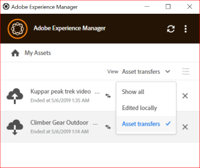

# Chargement de ressources {#upload-assets}

## Modifier des ressources et charger des ressources mises à jour dans [!DNL Experience Manager] {#edit-assets-upload-updated-assets}

Ouvrez les ressources à modifier lorsque vous souhaitez apporter des modifications et chargez les ressources mises à jour sur le serveur [!DNL Experience Manager]. Pour éviter tout conflit avec les modifications d’autres utilisateurs, utilisez l’application pour ouvrir une session de modification. Avant de commencer la modification, assurez-vous que la ressource ne comporte pas d’icône de verrou indiquant qu’un autre utilisateur la modifie.

Pour modifier une ressource, recherchez-la ou accédez à son emplacement. Cliquez sur  puis sur **[!UICONTROL Edit]**.

Utilisez **[!UICONTROL Toggle Check-out]** pour verrouiller la ressource afin d’éviter des conflits avec les modifications d’autres utilisateurs dans les deux cas suivants :

* Vous avez commencé à modifier une ressource sans d’abord l’extraire (vous l’avez simplement ouverte).
* Vous vous préparez à modifier une ressource et ne souhaitez pas que d’autres personnes le fassent.

Une fois les modifications effectuées, l’application affiche le statut **[!UICONTROL Edited Locally]** pour les ressources modifiées. Toutes les modifications enregistrées dans les ressources sont en local uniquement jusqu’à ce que vous les chargiez dans [!DNL Experience Manager]. Pour charger une ressource spécifique ou quelques ressources une par une, cliquez sur **[!UICONTROL Upload Changes]** dans les options d’une ressource. Une version de la ressource est alors créée dans [!DNL Experience Manager]. Grâce à l’interface web d’[!DNL Assets], vous pouvez afficher l’historique des ressources dans la vue [Chronologie](https://experienceleague.adobe.com/en/docs/experience-manager-65/content/assets/using/activity-stream).

Pour connaître les bonnes pratiques relatives à l’édition collaborative, voir [Processus avancé : collaborer sur les mêmes fichiers et éviter les conflits d’édition](#adv-workflow-collaborate-avoid-conflicts).

Dans les cas suivants, vous souhaiterez peut-être ignorer vos modifications apportées à la ressource locale. Cliquez sur **[!UICONTROL Discard Changes]**.

* Si vous ne souhaitez pas enregistrer vos modifications localement dans [!DNL Experience Manager].
* Vous commencez à apporter des modifications à la ressource d’origine après avoir enregistré certaines modifications.
* Vous arrêtez de modifier la ressource car cela n’est plus nécessaire.

Si nécessaire, activez l’extraction. La ressource mise à jour est supprimée du dossier de cache local et téléchargée à nouveau lorsque vous la modifiez ou l’ouvrez.

## Charger et ajouter de nouvelles ressources dans [!DNL Experience Manager] {#upload-and-add-new-assets-to-aem}

Les utilisateurs peuvent ajouter de nouvelles ressources au référentiel DAM. Par exemple, vous êtes un photographe d’agence ou un indépendant souhaitant ajouter au référentiel [!DNL Experience Manager] un grand nombre de photos d’une séance photo. Pour ajouter du contenu nouveau à [!DNL Experience Manager], sélectionnez  dans la barre supérieure de l’application. Accédez aux fichiers de ressources dans le système de fichiers local et cliquez sur **[!UICONTROL Select]**. Vous pouvez également charger des ressources en faisant glisser les fichiers ou les dossiers sur l’interface de l’application. Sous Windows, si vous faites glisser des ressources dans un dossier de l’application, elles sont chargées dans le dossier. Si le chargement prend plus de temps, l’application affiche une barre de progression.

<!-- 
-->

Vous pouvez charger des dossiers ou des fichiers spécifiques depuis votre système de fichiers local. La hiérarchie d’un dossier est conservée lorsque ce dossier est chargé. Avant de charger des ressources en masse, reportez-vous à [Chargements en masse](#bulk-upload-assets).

Pour afficher la liste des ressources transférées au cours d’une session donnée, cliquez sur **[!UICONTROL View]** > **[!UICONTROL Assets transfers]**. La liste vous permet d’afficher et de vérifier rapidement les transferts de fichiers de la session en cours.

Vous pouvez contrôler la simultanéité du chargement (accélération) dans **[!UICONTROL Preferences]** > paramètre **[!UICONTROL Upload acceleration]**. Une plus grande simultanéité permet généralement des chargements plus rapides, mais elle peut être gourmande en ressources et consommer davantage de puissance de traitement de l’ordinateur local. Si votre système devient lent, effectuez une nouvelle tentative de chargement à l’aide d’une valeur de simultanéité inférieure.

>[!NOTE]
>
>La liste de transfert n’est pas persistante et n’est pas disponible si vous quittez l’application et la rouvrez.

## Chargement massif de ressources {#bulk-upload-assets}

Les utilisateurs ou les organisations, comme les photographes ou les agences de création, peuvent créer de nombreuses ressources locales au cours d’activités telles que des séances photo, des retouches ou la sélection d’un ensemble plus grand. Ces tâches sont souvent effectuées en dehors de [!DNL Experience Manager]. Ils peuvent charger ces dossiers locaux volumineux dans [!DNL Assets] directement depuis l’appli de bureau. Les hiérarchies de dossiers sont conservées et l’ensemble des sous-dossiers imbriqués et des ressources incluses est chargé. Les ressources chargées sont immédiatement disponibles pour être utilisées par d’autres utilisateurs du même serveur. Les Assets sont chargées en arrière-plan, l’opération n’est donc pas liée à une session du navigateur web.

![Chargement massif de plusieurs dossiers locaux du bureau vers [!DNL Experience Manager]](assets/upload_local_folders_da2.png "Chargement massif de plusieurs dossiers locaux du bureau vers Experience Manager")

Après le chargement, si les modifications attendues ne sont pas répercutées dans l’application, cliquez sur l’icône Actualiser .

>[!NOTE]
>
>N’utilisez pas la fonctionnalité de chargement pour la migration des ressources sur deux déploiements [!DNL Experience Manager]. Consultez plutôt le [guide de migration](https://experienceleague.adobe.com/en/docs/experience-manager-65/content/assets/administer/assets-migration-guide).

## Étapes suivantes {#next-steps}

* [Regardez une vidéo pour commencer à utiliser l’application de bureau Adobe Experience Manager](https://experienceleague.adobe.com/en/docs/experience-manager-learn/assets/creative-workflows/aem-desktop-app)

* Faites des commentaires sur la documentation en utilisant [!UICONTROL Edit this page]  ou [!UICONTROL Log an issue]  disponible dans la barre latérale droite.

* Contacter l’[assistance clientèle](https://experienceleague.adobe.com/fr?support-solution=General#support)

>[!MORELIKETHIS]
>
>* [Télécharger des ressources](/help/using/download-assets.md)
>* [Comprendre l’interface utilisateur](/help/using/user-interface.md)
>* [Recherche](/help/using/search.md)
