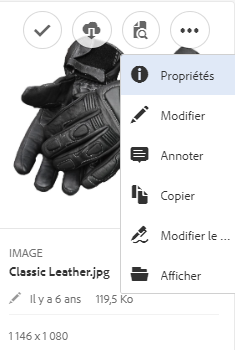

# Utilisation de l’appli de bureau [!DNL Experience Manager] v1.10 {#use-aem-desktop-app-v1x}

Grâce à l’appli, les ressources d’[!DNL Experience Manager] sont facilement accessibles sur votre ordinateur local et peuvent être utilisées dans n’importe quelle application de bureau. Les ressources sont aisément affichées dans le Finder de Mac ou l’Explorateur Windows, ouvertes dans des applications de bureau et modifiées localement ; les modifications sont réenregistrées dans [!DNL Experience Manager] avec une nouvelle version créée dans le référentiel.

Cette intégration permet une gestion centralisée des ressources et un accès à l’ensemble des applications Creative Cloud et autres, en assurant la conformité avec les normes de branding et d’autres normes.

Les tâches clés que vous effectuez à l’aide de l’appli de bureau [!DNL Experience Manager] v1 sont les suivantes :

1. [Connexion avec un serveur [!DNL Experience Manager] &#x200B;](#installandconnect)
1. [Ouverture directe de ressources sur l’appli de bureau](#openondesktop)
1. [Modification et extraction de ressources à partir de l’appli de bureau](#workonassets)
1. [Chargement en masse de ressources et de dossiers](#bulkupload)

Pour les pratiques recommandées, consultez les [bonnes pratiques pour utiliser l’appli de bureau](best-practices-for-v1.md). Si vous rencontrez des problèmes lors de l’utilisation de l’application, consultez la page [résolution des problèmes de l’appli de bureau  [!DNL Experience Manager] 2&rbrace;.](troubleshoot-app-v1.md)

>[!NOTE]
>
>L’appli de bureau a été introduite dans la version 6.1 d’[!DNL Experience Manager] sous le nom d’[!DNL Experience Manager Assets Companion App].

## [!DNL Experience Manager] Points de contact de l’appli de bureau dans le workflow de création {#aem-desktop-app-touch-points-in-the-creative-workflow}

L’appli de bureau [!DNL Experience Manager], avec [!DNL Assets], s’intègre dans votre workflow créatif et propose les points de contact suivants.

Points de contact de l’appli de bureau ![[!DNL Experience Manager] dans le workflow créatif](assets/aem_desktopapp_workflow.png)

Points de contact de l’appli de bureau [!DNL Experience Manager] dans le workflow créatif

## Installez l’application et connectez-la au serveur [!DNL Experience Manager] {#installandconnect}

Pour pouvoir commencer à créer ou modifier les ressources de création, connectez l’application de bureau au serveur [!DNL Assets] pour télécharger et charger des ressources dans le référentiel. Effectuez les tâches suivantes :

1. [Installez l’application](#installapp).
1. [Définissez vos préférences](#inapppref) et vos informations de connexion.
1. [Connectez-vous à un serveur [!DNL Experience Manager] &#x200B;](#connect)et montez le référentiel de ressources comme lecteur local.
1. [Activez les actions de bureau](#desktopactions) sur le serveur [!DNL Experience Manager].

L’appli de bureau [!DNL Experience Manager] utilise une connexion HTTPS au serveur [!DNL Experience Manager] pour transférer vos ressources de manière sécurisée.

>[!NOTE]
>
>Pour l’ensemble ou une partie des étapes d’installation et de configuration, vous aurez peut-être besoin de l’aide de votre administrateur [!DNL Experience Manager] ou de votre administrateur système.

### Installation de l’application {#installapp}

Assurez-vous que l’application prend en charge votre version du serveur Experience Manager pour utiliser l’appli de bureau Experience Manager. Téléchargez le fichier d’installation approprié (binaire) pour votre système d’exploitation (Mac ou Windows) et installez ensuite l’application.

Une configuration détaillée peut s’avérer nécessaire en fonction des préférences de votre système et de votre réseau. Pour plus d’informations, voir [Installation et configuration de l’appli de bureau [!DNL Experience Manager] &#x200B;](install-configure-app-v1.md).

1. Rendez-vous sur la page de téléchargement de l’appli de bureau [[!DNL Experience Manager] v1.10](/help/using/release-notes-of-v1.md) et téléchargez le fichier binaire approprié pour votre système d’exploitation.
1. Exécutez le fichier d’installation téléchargé et suivez les instructions affichées à l’écran pour installer l’application.

   >[!NOTE]
   >
   >Une seule instance de l’appli de bureau [!DNL Experience Manager] peut être installée et active à la fois.

### Présentation des options et des préférences dans l’application {#inapppref}

L’application permet des paramètres de connexion et de déconnexion des serveurs [!DNL Experience Manager], d’afficher l’état des chargements, de gérer le cache local, etc. Les paramètres par défaut sont opérationnels pour un utilisateur ordinaire de l’application. Vous pouvez ajuster les paramètres pour tirer le meilleur parti de l’application. Et obtenez plus de l’intégration avec le serveur [!DNL Experience Manager]. Voici les différents paramètres :

**Explore Assets (Explorer les ressources)** Ouvrez le lecteur local sur lequel est monté le référentiel [!DNL Assets]. En d’autres termes, explorez les ressources qui sont désormais disponibles sur votre ordinateur local.

**View asset status (Afficher le statut des ressources)** Lorsque des ressources modifiées sont chargées ou que de nouvelles ressources sont ajoutées au référentiel [!DNL Assets], l’application procède à leur chargement en arrière-plan. Le chargement en arrière-plan permet des opérations fluides, sans qu’il faille attendre la fin du chargement, en particulier pour les ressources de grande taille. Vous pouvez enregistrer vos modifications localement et les oublier. L’application prend un certain temps pour envoyer ces ressources au serveur, selon la bande passante disponible. Vous pouvez vérifier l’état du chargement, avec d’autres informations de base.

**Options** Cliquez sur les options de la barre d’état de l’appli de bureau pour définir l’application à lancer au démarrage, connectez-vous au serveur [!DNL Experience Manager] au lancement et modifiez la lettre du lecteur local pour [!DNL Assets] après le montage.

**Advanced > Manage cache (Avancé > Gérer le cache)** Vous pouvez contrôler la quantité d’espace disque disponible pour la mise en cache locale. Les artefacts du serveur [!DNL Assets] sont mis en cache localement pour garantir une expérience plus fluide. Vous pouvez modifier les valeurs par défaut en fonction de vos besoins. Vous pouvez également vider le cache pour récupérer à nouveau toutes les ressources. Lorsque vous effacez le cache, les modifications non enregistrées sont conservées. Toutes les ressources non archivées dans le serveur [!DNL Experience Manager] sont conservées et ne sont pas supprimées.

### Connexion à un serveur [!DNL Experience Manager] {#connect}

L’application prend en charge la configuration du proxy sous Mac et Windows. La configuration est lue au démarrage de l’application. Si vous modifiez les paramètres du proxy, redémarrez l’application pour que les modifications soient prises en compte.

>[!NOTE]
>
>Si vous modifiez les paramètres du proxy, redémarrez l’application pour que les modifications soient prises en compte. Sans cela, l’application continue à utiliser le serveur proxy précédemment configuré.

1. Lancez l’appli de bureau [!DNL Experience Manager]. Pour mapper votre instance avec l’application [!DNL Experience Manager], spécifiez votre serveur [!DNL Experience Manager] au format `https://[aem-server-url]:[port]`.

   ![Authentification sous Mac et spécification de l’URL du serveur [!DNL Experience Manager]](assets/aem_desktop_app_server_url.png)

1. Dans l’écran de connexion, indiquez le nom d’utilisateur et le mot de passe de votre instance. Pour spécifier une autre instance [!DNL Experience Manager], sélectionnez l’option **[!UICONTROL Alternate Login URL]**.

   ![Saisie des informations d’identification du serveur [!DNL Experience Manager] dans l’écran de connexion de l’appli de bureau [!DNL Experience Manager]](assets/login_screen_v1.png)

### Activation des actions de bureau dans l’interface Web d’[!DNL Experience Manager] {#desktopactions}

À partir de l’interface utilisateur Assets, vous pouvez explorer l’emplacement des ressources ou extraire une ressource et l’ouvrir afin de la modifier dans votre appli de bureau. Ces options, appelées actions de bureau, ne sont pas activées par défaut. Procédez comme suit pour les activer.

1. Dans l’interface Assets, cliquez/appuyez sur l’icône Utilisateur dans le coin supérieur droit de la barre d’outils.
1. Cliquez sur **[!UICONTROL My Preferences]** pour afficher la boîte de dialogue **[!UICONTROL Preferences]**.

   ![[!DNL Experience Manager] Interface avec les préférences utilisateur](assets/aem_ui_user_preferences.png)

1. Dans la boîte de dialogue [!UICONTROL User Preferences], sélectionnez **[!UICONTROL Show Desktop Actions For Assets]**, puis cliquez sur **[!UICONTROL Accept]**.

   ![Cocher la case [!UICONTROL Show Desktop Actions For Assets] pour activer les actions de bureau](assets/enable_desktop_actions.png)

   *Figure : cochez la case [!UICONTROL Show Desktop Actions For Assets] pour activer les actions de bureau.*

## Accès aux ressources et ouverture de ces éléments sur votre bureau {#openondesktop}

Lorsque vous cliquez sur **Ouvrir** pour ouvrir une ressource sur votre ordinateur local, l’application la télécharge dans son cache interne. L’application lance l’appli de bureau native associée au type de fichier de la ressource téléchargée.

Sur Mac, sélectionnez **Ouvrir** dans le menu contextuel pour ouvrir une ressource via l’appli de bureau [!DNL Experience Manager]. Sous Windows, sélectionnez Ouvrir sur le web dans le menu contextuel pour ouvrir la ressource. Dans la fenêtre Asset Status (Statut de la ressource), cliquez/appuyez sur  pour ouvrir la ressource.

Pour les fichiers Adobe InDesign (INDD), sélectionnez **[!UICONTROL Open]** dans le menu contextuel. Lorsque vous cliquez sur cette option, l’application télécharge les ressources liées sur votre système de fichiers local, puis ouvre le fichier INDD dans Adobe InDesign. Cette méthode garantit que les ressources requises sont disponibles en local lors de la modification du fichier INDD.

![Options de menu contextuel permettant d’accéder à des ressources et de les ouvrir à l’aide de l’appli de bureau [!DNL Experience Manager]](assets/aem_desktopapp_mac_context_menu.png)

*Figure : Options de menu contextuel permettant d’accéder à des ressources et de les ouvrir à l’aide de l’appli de bureau [!DNL Experience Manager].*

>[!NOTE]
>
>Adobe recommande d’accéder aux options de présentation du Finder sous Mac et de désactiver les options **Afficher les informations**, **Utiliser un aperçu comme icône** et **Afficher la colonne d’aperçu** pour le dossier [!DNL Assets] monté. Cela améliore les performances.

### Autres options de l’interface [!DNL Experience Manager] {#additional-options-in-aem-assets}

Après avoir mappé le référentiel [!DNL Assets] sur votre lecteur local, vous pouvez activer des icônes supplémentaires, ainsi que la fonction de téléchargement de dossiers, afin qu’elles s’affichent pour les ressources et les dossiers mappés.

1. Ouvrez l’interface d’[!DNL Assets] et placez le pointeur sur un dossier ou une ressource afin d’afficher les actions de bureau sous la forme d’actions rapides dans le mode Carte.

   

   *Figure : Dans l’interface utilisateur d’Assets, ouvrez le menu des actions rapides pour afficher les actions de bureau.*

   Ces actions de bureau sont également disponibles lorsque vous cliquez sur l’option **Actions sur le Bureau** dans la barre d’outils après la sélection de la ressource ou dans la barre d’outils de la page de la ressource.

1. Pour ouvrir la ressource dans l’application de bureau associée à l’extension de fichier spécifique, cliquez sur l’action rapide **Ouvrir sur le bureau** .

   Vous pouvez également sélectionner **Ouvrir** dans le menu **Actions sur le Bureau** de la barre d’outils.

Pour localiser la ressource sur votre système de fichiers local, cliquez sur l’action rapide **Afficher** . Vous pouvez également sélectionner **Afficher** dans le menu **Actions sur le Bureau** de la barre d’outils.

## Explication des états des ressources {#understand-the-asset-statuses}

|  | L’application est connectée au serveur et toutes les ressources sont synchronisées. |
--- |--- |
|  | L’application est lancée, mais n’est pas connectée au serveur. Certaines ressources peuvent être en attente de synchronisation. |
|  | Les ressources sont en cours de synchronisation. Les fichiers sont en cours de chargement ou téléchargés. Vous pouvez afficher les statuts précis et suspendre les transferts dans la fenêtre Asset Status (Statut de la ressource). |
|  | L’application effectue une tentative de reconnexion. Les problèmes réseau peuvent entraîner sa déconnexion. |

## Utilisation de vos ressources {#workonassets}

### Extraction de ressources à partir de l’interface web d’[!DNL Experience Manager] {#check-out-assets-from-the-aem-web-interface}

[!DNL Experience Manager Assets] permet d’extraire des ressources pour les modifier et de les ré-archiver après y avoir apporté les modifications. Après avoir extrait une ressource, vous seul pouvez la modifier, l’annoter, la publier, la déplacer ou la supprimer. Le fait d’extraire une ressource entraîne son verrouillage et empêche les autres utilisateurs d’effectuer l’une de ces opérations. Vous avez besoin d’un accès en écriture à ces ressources pour être en mesure de les extraire ou de les archiver.

Pour extraire des ressources à partir de l’interface web d’[!DNL Experience Manager], deux méthodes sont possibles. Pour plus d’informations sur la première méthode, voir les [fichiers d’archivage et de passage en caisse de l’interface utilisateur d’Assets](https://experienceleague.adobe.com/fr/docs/experience-manager-65/content/assets/managing/check-out-and-submit-assets). Suivez ces étapes pour la deuxième méthode pour extraire et ouvrir la ressource lorsque l’appli de bureau [!DNL Experience Manager] est installée.

1. Ouvrez l’interface d’[!DNL Assets] et placez le pointeur sur un dossier ou une ressource afin d’afficher les actions de bureau sous la forme d’actions rapides dans le mode Carte.

   

   Ces actions de bureau sont également disponibles lorsque vous cliquez/appuyez sur l’icône Desktop Actions (Actions sur le Bureau) dans la barre d’outils après la sélection de la ressource ou dans la barre d’outils de la page de la ressource.

1. Pour ouvrir la ressource, cliquez/appuyez sur l’action rapide Open on desktop (Ouvrir sur le Bureau) .

   Vous pouvez également sélectionner Open (Ouvrir) dans le menu Desktop Actions (Actions sur le Bureau) de la barre d’outils.

   >[!NOTE]
   >
   >Lorsque vous modifiez un fichier ouvert mais non extrait, d’autres utilisateurs ne savent pas que vous mettez à jour la ressource.

1. Pour ouvrir une ressource en vue de la modifier dans une application Adobe Creative Cloud, cliquez sur . Cette option extrait également la ressource en vue de la modifier. Après avoir procédé aux modifications, archivez la ressource pour mettre à jour les modifications dans [!DNL Assets].

   Vous pouvez également sélectionner Edit (Modifier) dans le menu Desktop Actions (Actions sur le Bureau) de la barre d’outils.

1. Sélectionnez l’option de menu Open (Ouvrir). Les ressources sélectionnées sont ouvertes en mode d’aperçu.
1. Pour modifier les ressources, sélectionnez l’option Edit (Modifier). Les ressources sont ouvertes en mode d’édition.

### Extraction de ressources à partir du Finder sur macOS {#check-out-assets-on-mac}

L’application vous permet d’extraire des fichiers de ressources pour empêcher d’autres utilisateurs de modifier les fichiers sur lesquels vous travaillez.

1. Dans le menu contextuel de Mac, sélectionnez l’option Ouvrir le dossier AEM Assets pour ouvrir le Finder.

   ![Options de menu contextuel permettant d’accéder à des ressources et de les ouvrir à l’aide de l’appli de bureau [!DNL Experience Manager]](assets/aem_desktopapp_mac_context_menu.png)

   *Figure : Options de menu contextuel permettant d’accéder à des ressources et de les ouvrir à l’aide de l’appli de bureau [!DNL Experience Manager].*

1. Accédez à la ressource à extraire.
1. Cliquez avec le bouton droit sur la ressource, puis choisissez More Assets Info (Plus d’infos sur la ressource) dans le menu contextuel.
1. Dans la boîte de dialogue Asset Info (Informations sur les ressources), cliquez/appuyez sur l’icône Checkout (Extraire) pour extraire la ressource. L’icône Checkout (Extraire) se change en icône Check-in (Archiver) une fois que vous cliquez/appuyez dessus.

   

1. Pour archiver la ressource afin qu’elle soit disponible pour les autres utilisateurs, cliquez/appuyez sur l’icône Check-in (Archiver) dans la boîte de dialogue Asset Info (Informations sur les ressources).

### Extraction de ressources sous Windows {#check-out-assets-on-windows}

L’application vous permet d’extraire des fichiers de ressources pour empêcher d’autres utilisateurs de modifier les fichiers sur lesquels vous travaillez.

1. Dans le menu contextuel, sélectionnez Explorer les ressources pour ouvrir l’Explorateur.
1. Dans l’Explorateur, accédez à l’emplacement de la ressource à extraire.
1. Cliquez avec le bouton droit de la souris sur la ressource et sélectionnez Ouvrir sur le Web dans le menu contextuel.
1. Dans la boîte de dialogue Asset Info (Informations sur les ressources), cliquez sur l’icône Checkout (Extraire). L’icône Checkout (Extraire) se change en icône Check-in (Archiver).

   

1. Consultez la ressource dans l’Explorateur. L’icône de verrouillage sur la ressource  indique que vous avez extrait cette dernière.

   >[!NOTE]
   >
   >L’icône de verrouillage peut s’afficher après un certain délai. L’appli de bureau [!DNL Experience Manager] met en cache les ressources en vue d’un accès rapide. La mise à jour de l’état Verrouillé peut donc prendre quelques instants.

1. Pour archiver la ressource afin qu’elle soit disponible pour les autres utilisateurs, cliquez/appuyez sur l’icône Check-in (Archiver) dans la boîte de dialogue **Asset Info** (Informations sur les ressources).

### Archivage d’une ressource à l’aide du Finder ou de l’Explorateur et en utilisant l’interface web {#check-in-an-asset-using-finder-or-explorer-and-using-web-interface}

Une fois la modification des ressources effectuée, enregistrez ces dernières dans votre application de bureau. Dans le menu contextuel, sélectionnez **More Assets Info** (Autres infos sur les ressources) et cliquez ensuite sur Check-in (Archiver).

Les ressources sont chargées sur le serveur [!DNL Experience Manager]. Vous pouvez vérifier le statut du chargement en sélectionnant **View Asset Status** (Afficher le statut des ressources) à partir de l’icône de la barre d’état. Vous pouvez également archiver une ressource à partir de l’interface web d’[!DNL Experience Manager]. Cliquez sur les ressources extraites ou sélectionnez-les. Dans la barre d’outils, cliquez sur l’icône d’archivage .

Une ressource est automatiquement chargée dans [!DNL Experience Manager] après l’enregistrement local de toutes les modifications. L’archivage rend la ressource disponible pour modification par d’autres utilisateurs d’[!DNL Experience Manager].

### Chargement groupé de ressources et de dossiers vers le serveur [!DNL Experience Manager] {#bulkupload}

À l’aide de l’appli de bureau [!DNL Experience Manager], vous pouvez charger un dossier entier contenant des ressources de votre répertoire de fichiers local vers [!DNL Assets]. Ainsi, toutes les ressources du dossier sont chargées en bloc et non une par une.

1. Dans l’interface utilisateur d’Assets, cliquez/appuyez sur **Créer** dans la barre d’outils, puis, dans le menu, sélectionnez **Télécharger le dossier**.
1. Accédez au dossier que vous souhaitez charger et sélectionnez-le.
1. Cliquez/appuyez sur OK. La boîte de dialogue Assets Status (Statut des ressources) affiche le statut du chargement.

   

   Consultation de l’état du chargement dans la fenêtre Asset Status (Statut de la ressource)

   >[!NOTE]
   >
   >Vous pouvez suspendre ou annuler manuellement le chargement en cliquant/appuyant sur l’icône appropriée.

1. Une fois le dossier chargé, fermez la boîte de dialogue et accédez à l’interface utilisateur d’Assets. Le dossier chargé s’affiche dans l’interface web.

Adobe ne recommande pas de copier-coller ni de faire glisser un plus grand nombre de fichiers ou de dossiers imbriqués, depuis le système de fichiers local, vers la zone de partage réseau. L’application ne peut pas contrôler le processus de chargement en raison de limitations techniques et de faibles performances.

Vous pouvez également sélectionner des fichiers/dossiers dans le Finder ou l’Explorateur, les copier, accéder au dossier cible dans la zone de partage réseau et choisir **Coller Assets** dans le menu contextuel de l’appli de bureau [!DNL Experience Manager]. Ainsi, l’appli de bureau [!DNL Experience Manager] commence à charger les ressources collées, comme avec l’option **Télécharger le dossier** disponible dans l’interface web [!DNL Experience Manager].

>[!MORELIKETHIS]
>
>* [Résolution des problèmes liés à l’appli de bureau [!DNL Experience Manager] &#x200B;](troubleshoot-app-v1.md)
