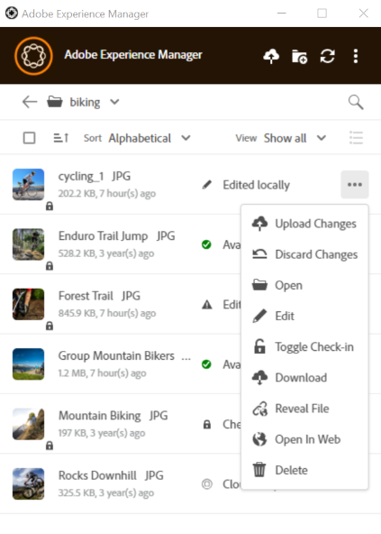

# Utilisation de l’appli de bureau [!DNL Adobe Experience Manager]  {#use-aem-desktop-app-v2}

Utilisez l’application de bureau [!DNL Adobe Experience Manager] pour accéder aux ressources numériques stockées dans un référentiel de gestion des ressources numériques [!DNL Adobe Experience Manager] sur votre bureau local. Vous pouvez ensuite utiliser ces ressources dans n’importe quelle application de bureau. Vous pouvez ouvrir et modifier les ressources localement dans les applications de bureau. Après avoir apporté des modifications, chargez-les à nouveau dans [!DNL Experience Manager] avec le contrôle de version pour partager les mises à jour avec d’autres utilisateurs. Vous pouvez également charger de nouveaux fichiers et des hiérarchies de dossiers vers [!DNL Experience Manager], créer des dossiers et supprimer des ressources ou des dossiers dans le DAM d’[!DNL Experience Manager].

L’intégration permet à divers rôles de l’organisation de gérer les ressources de manière centralisée dans [!DNL Experience Manager Assets] et d’accéder aux ressources sur le bureau local dans les applications natives sous Windows ou macOS.

Lorsque vous ouvrez l’application après vous être déconnecté ou lorsque vous vous connectez pour la première fois, fournissez l’URL de votre serveur [!DNL Experience Manager] au format `https://[aem-server-url]:[port]/`. Sélectionnez ensuite l’option [!UICONTROL Connect]. Indiquez vos informations d’identification pour connecter l’application au serveur.

L’application de bureau [!DNL Adobe Experience Manager] vous permet d’effectuer les tâches clés suivantes :

![Workflows et tâches pouvant être effectués avec les workflows de l’application de bureau [!DNL Experience Manager]](assets/aem_desktop_app_usecases_v2.png "Workflows et tâches pouvant être effectués avec l’appli de bureau  [!DNL Adobe Experience Manager] ")

Télécharger [ce](assets/aem_desktop_app_usecases_print.pdf) fichier PDF prêt à imprimer.

## Fonctionnement de l’appli de bureau {#how-app-works2}

Avant de commencer à utiliser l’application, vous devez comprendre [son fonctionnement](release-notes.md#how-app-works). Familiarisez-vous également avec les termes suivants :

* **[!UICONTROL Desktop Actions]** : à partir de l’interface web d’Assets, dans un navigateur , vous pouvez explorer l’emplacement des ressources ou extraire et ouvrir la ressource pour la modifier dans votre application de bureau native. Ces actions sont disponibles à partir de l’interface web et utilisent la fonctionnalité de l’application de bureau . Voir [Comment activer les actions de bureau](using.md#desktopactions-v2).

* Le statut du fichier est **[!UICONTROL Cloud Only]** : ces ressources ne sont pas téléchargées sur l’ordinateur local et ne sont disponibles que sur le serveur [!DNL Experience Manager].

* Le statut du fichier est **[!UICONTROL Available locally]** : les ressources sont téléchargées et disponibles sur l’ordinateur local en l’état. Les ressources ne sont pas modifiées.

* Le statut du fichier est **[!UICONTROL Edited locally]** : ces ressources sont modifiées localement et les modifications restent à charger vers le serveur [!DNL Experience Manager]. Après le chargement, le statut passe à [!UICONTROL Available locally]. Voir [Modification de ressources](using.md#edit-assets-upload-updated-assets).

* Le statut du fichier est **[!UICONTROL Editing conflict]** : si vous et d’autres personnes modifiez une ressource simultanément, l’application indique qu’un conflit de modification s’est produit. L’application propose également des options pour conserver ou ignorer vos modifications. Découvrez [comment éviter les conflits de modification](using.md#adv-workflow-collaborate-avoid-conflicts).

* Le statut du fichier est **[!UICONTROL Modified remotely]** : l’application indique si une ressource que vous avez téléchargée est modifiée sur le serveur [!DNL Experience Manager]. L’application permet également de télécharger la dernière version et de mettre à jour votre copie locale. Découvrez [comment éviter les conflits de modification](using.md#adv-workflow-collaborate-avoid-conflicts).

* **[!UICONTROL Check-out]** : si vous modifiez un fichier ou envisagez de le modifier, faites-le passer au statut d’extraction. Une icône de cadenas est ajoutée à la ressource dans l’application et [!DNL Experience Manager]’interface web. Cette icône indique aux autres utilisateurs d’éviter de modifier simultanément la même ressource, car cela entraînerait un conflit de modification.

* **[!UICONTROL Check-in]** : marquez la ressource comme étant sécurisée pour que d’autres utilisateurs puissent la modifier sans provoquer de conflit de modification. Lorsque vous chargez vos modifications, l’icône de verrouillage disparaît automatiquement. Activer/désactiver le statut d’archivage supprime également l’icône de cadenas, bien qu’Adobe recommande d’éviter de procéder à l’archivage manuel sans charger les modifications. Si vous annulez vos modifications, activez manuellement le statut d’archivage.

* Action **[!UICONTROL Open]** : ouvrez simplement la ressource pour la prévisualiser dans l’application native. Adobe vous recommande d’éviter de modifier la ressource à l’aide de cette action. La raison en est qu’il n’extrait pas la ressource. Pendant ce temps, d’autres utilisateurs peuvent apporter des modifications entraînant des conflits de modification.

* Action **[!UICONTROL Edit]** : utilisez l’action pour modifier l’image. Un clic sur [!UICONTROL Edit] extrait la ressource et ajoute une icône de verrou à la ressource. Après avoir cliqué sur Edit (Modifier), si vous ne souhaitez pas modifier la ressource, cliquez sur [!UICONTROL Toggle check-in]. Pour supprimer, renommer ou déplacer des ressources dans la hiérarchie de dossiers de la gestion des ressources numériques [!DNL Experience Manager], utilisez les actions de l’interface web [!DNL Experience Manager] et non l’action de modification.

* Action **[!UICONTROL Download]** : téléchargez la ressource sur votre ordinateur local. Vous pouvez télécharger les ressources maintenant et les modifier ultérieurement et travailler hors ligne et charger les modifications ultérieurement. Les fichiers sont téléchargés dans un dossier de cache sur votre système de fichiers.

* Action **[!UICONTROL Reveal File]** ou **[!UICONTROL Reveal Folder]** : lorsque les ressources sont téléchargées dans un dossier de cache local, l’application imite un lecteur réseau local. Il fournit un chemin d’accès local pour chaque ressource. Pour découvrir ce chemin d’accès, utilisez l’option d’affichage appropriée dans l’application. Une action d’affichage est requise pour placer des ressources dans l’application Creative Cloud. Voir [Placement de ressources](using.md#place-assets-in-native-documents).

* Action **[!UICONTROL Open In Web]** : pour afficher la ressource dans l’interface web [!DNL Experience Manager], ouvrez-la dans le Web. Vous pouvez lancer d’autres workflows à partir de l’interface [!DNL Experience Manager], comme la mise à jour des métadonnées ou la découverte de ressources.

* Action **[!UICONTROL Delete]** : supprimez la ressource du référentiel DAM d’[!DNL Experience Manager]. L’action supprime la copie d’origine de la ressource sur le serveur Experience Manager. Si vous souhaitez uniquement ignorer les modifications apportées à la ressource locale, voir [ignorer les modifications](using.md#edit-assets-upload-updated-assets).

* **[!UICONTROL Upload Changes]** : l’application de bureau charge la ressource mise à jour uniquement lorsque vous effectuez un chargement explicite sur le serveur [!DNL Experience Manager]. Lorsque vous enregistrez vos modifications, celles-ci ne sont enregistrées que sur votre ordinateur local. Lors du chargement, la ressource est automatiquement archivée et l’icône de verrouillage est supprimée. Voir [Modification de ressources](using.md#edit-assets-upload-updated-assets).

## Activation des actions de bureau dans [!DNL Experience Manager]’interface web d’ {#desktopactions-v2}

À partir de l’interface utilisateur d’[!DNL Assets] ouverte dans un navigateur, vous pouvez explorer l’emplacement des ressources ou extraire et ouvrir une ressource pour la modifier dans votre appli de bureau. Ces options, qui sont appelées [!UICONTROL Desktop Actions], ne sont pas activées par défaut. Pour les activer, procédez comme suit.

1. Dans la console [!DNL Assets], cliquez sur l’icône **[!UICONTROL User]** dans la barre d’outils.
1. Cliquez sur **[!UICONTROL My Preferences]** pour afficher la boîte de dialogue **[!UICONTROL Preferences]**.

1. Dans la boîte de dialogue [!UICONTROL User Preferences], sélectionnez **[!UICONTROL Show Desktop Actions For Assets]**, puis cliquez sur **[!UICONTROL Accept]**.

   

   *Image : sélectionnez [!UICONTROL Show Desktop Actions For Assets] pour activer les actions de bureau.*

## Parcourir, rechercher et prévisualiser des ressources {#browse-search-preview-assets}

Vous pouvez parcourir, rechercher et prévisualiser les ressources disponibles dans le référentiel d’[!DNL Experience Manager], le tout depuis l’appli de bureau. Essayez les options suivantes dans l’application :

1. Accédez à un dossier et affichez des informations de base sur les ressources disponibles dans ce dossier, ainsi que de petites vignettes de toutes les ressources.

   

1. Pour afficher davantage d’informations et une vignette plus grande d’une ressource spécifique, cliquez sur le nom de fichier de la ressource.

   

1. Cliquez sur **[!UICONTROL Open]** ou **[!UICONTROL Edit]** pour télécharger le fichier localement et l’afficher uniquement ou pour le modifier dans l’application native, respectivement.
1. Recherchez à l’aide de mots-clés une ressource associée dans le référentiel d’[!DNL Experience Manager]. Utilisez `?` et `*` comme caractères génériques. Ces caractères génériques remplacent un caractère unique ou plusieurs caractères, respectivement. Filtrez et triez les résultats selon vos besoins.

   

   

>[!NOTE]
>
>L’application affiche les ressources en faisant correspondre les critères de recherche de plusieurs champs de métadonnées et pas uniquement le titre ou le nom de fichier de la ressource.

## Téléchargement de ressources {#download-assets}

Vous pouvez télécharger les ressources sur votre système de fichiers local. L’application récupère les ressources à partir du serveur [!DNL Experience Manager] et enregistre la même copie sur votre système de fichiers local.

Cliquez sur  pour afficher les options, puis sur  pour télécharger.

>[!NOTE]
>
>Lors du téléchargement ou du chargement d’un fichier volumineux ou de plusieurs fichiers, l’application désactive les actions sur les ressources et les dossiers. Les actions sont disponibles lorsque le téléchargement ou le chargement est terminé.

Le téléchargement de plusieurs ressources peut entraîner de faibles performances si la taille de la file d’attente est importante ou si vous rencontrez des problèmes réseau. En outre, vous pouvez sans le savoir placer en file d’attente de nombreuses ressources à télécharger lorsque vous téléchargez un dossier. Pour éviter de longs temps d’attente, l’application limite le nombre de ressources téléchargées en une seule fois. Pour savoir comment configurer cette fonctionnalité, voir [Définition des préférences](install-upgrade.md#set-preferences). Même en dessous de cette limite, l’application peut parfois rechercher une confirmation avant de télécharger un dossier apparemment volumineux.

Si des dossiers sont sélectionnés et téléchargés, l’application télécharge uniquement les ressources stockées directement dans les dossiers de [!DNL Experience Manager]. Elle ne télécharge pas automatiquement les ressources des sous-dossiers.

## Ouvrir des ressources sur votre bureau {#openondesktop-v2}

Vous pouvez ouvrir les ressources distantes pour les afficher dans l’application native. Les ressources sont téléchargées dans un dossier local. Elles sont ensuite lancées dans l’application native associée au format de fichier. Vous pouvez changer l’application native pour ouvrir des types de fichiers (extensions) spécifiques sous Mac ou Windows.

Cliquez sur **[!UICONTROL Open]** dans le menu de ressource. La ressource est téléchargée localement et ouverte dans l’application native. Vérifiez la progression du téléchargement et la vitesse de transfert des ressources volumineuses dans la barre d’état.

<!-- 
-->

>[!NOTE]
>
>Si les modifications attendues ne sont pas reflétées dans l’application, cliquez sur l’icône Actualiser  ou cliquez avec le bouton droit de la souris sur l’interface de l’application, puis cliquez sur **[!UICONTROL Refresh]**. Les actions ne sont pas disponibles lorsque des téléchargements ou des chargements plus volumineux sont en cours.

Pour ouvrir le dossier de téléchargement local d’une ressource, cliquez sur , puis sur l’action  **[!UICONTROL Reveal File]**.

## Utiliser ou placer des ressources dans des documents natifs {#place-assets-in-native-documents}

Dans certains cas (par exemple, lorsque vous importez un fichier dans un document natif), vous accédez à un fichier dans l’Explorateur Windows ou le Finder Mac. Pour accéder à l’emplacement de système de fichiers du fichier téléchargé localement, utilisez l’option  **[!UICONTROL Reveal File]**.

Cliquez sur **[!UICONTROL Reveal File]**, ou **[!UICONTROL Reveal Folder]** sur un dossier, pour ouvrir l’Explorateur Windows ou le Finder Mac avec le fichier ou le dossier présélectionné sur votre ordinateur local. Par exemple, l’option est utile pour placer les fichiers [!DNL Experience Manager] dans les applications natives qui prennent en charge le placement ou la liaison de fichiers locaux. Pour savoir comment placer des fichiers dans Adobe InDesign, voir [Placement de graphiques](https://helpx.adobe.com/fr/indesign/using/placing-graphics.html).

L’action **[!UICONTROL Reveal File]** ouvre un partage réseau local. Elle affiche uniquement les ressources disponibles localement. En d’autres termes, elle affiche les ressources qui ont été révélées, téléchargées ou ouvertes/modifiées à l’aide de l’application. Le partage réseau local ne charge aucune modification dans [!DNL Experience Manager]. Pour charger les modifications, utilisez explicitement les actions **[!UICONTROL Upload Changes]** ou **[!UICONTROL Upload]** dans l’application.

>[!NOTE]
>
>Pour une compatibilité descendante avec l’appli de bureau [!DNL Experience Manager] v1.x, les fichiers affichés sont diffusés à partir d’un partage réseau local, exposant uniquement les fichiers disponibles en local. Les chemins d’accès aux fichiers affichés sont identiques à ceux créés par l’application v1.x.

>[!CAUTION]
>
>N’utilisez pas l’option **[!UICONTROL Reveal File]** pour modifier des ressources dans les applications natives. Utilisez plutôt les actions **[!UICONTROL Edit]**. Pour en savoir plus, consultez la section [Workflow avancé : collaborer sur les mêmes fichiers et éviter les conflits de modification](#adv-workflow-collaborate-avoid-conflicts).

## Modifier des ressources et charger des ressources mises à jour dans [!DNL Experience Manager] {#edit-assets-upload-updated-assets}

Ouvrez les ressources à modifier lorsque vous souhaitez apporter des modifications et chargez les ressources mises à jour sur le serveur [!DNL Experience Manager]. Pour éviter tout conflit avec les modifications d’autres utilisateurs, utilisez l’application pour ouvrir une session de modification. Avant de commencer la modification, assurez-vous que la ressource ne comporte pas d’icône de verrou indiquant qu’un autre utilisateur la modifie.

Pour modifier une ressource, recherchez-la ou accédez à son emplacement. Cliquez sur  puis sur **[!UICONTROL Edit]**.

Utilisez **[!UICONTROL Toggle Check-out]** pour verrouiller la ressource afin d’éviter des conflits avec les modifications d’autres utilisateurs dans les deux cas suivants :

* Vous avez commencé à modifier une ressource sans d’abord l’extraire (vous l’avez simplement ouverte).
* Vous vous préparez à modifier une ressource et ne souhaitez pas que d’autres personnes le fassent.

Une fois les modifications effectuées, l’application affiche le statut **[!UICONTROL Edited Locally]** pour les ressources modifiées. Toutes les modifications enregistrées dans les ressources sont en local uniquement jusqu’à ce que vous les chargiez dans [!DNL Experience Manager]. Pour charger une ressource spécifique ou quelques ressources une par une, cliquez sur **[!UICONTROL Upload Changes]** dans les options d’une ressource. Une version de la ressource est alors créée dans [!DNL Experience Manager]. Grâce à l’interface web d’[!DNL Assets], vous pouvez afficher l’historique des ressources dans la vue [Chronologie](https://experienceleague.adobe.com/fr/docs/experience-manager-65/content/assets/using/activity-stream).

Pour connaître les bonnes pratiques relatives à l’édition collaborative, voir [Processus avancé : collaborer sur les mêmes fichiers et éviter les conflits d’édition](#adv-workflow-collaborate-avoid-conflicts).

Dans les cas suivants, vous souhaiterez peut-être ignorer vos modifications apportées à la ressource locale. Cliquez sur **[!UICONTROL Discard Changes]**.

* Si vous ne souhaitez pas enregistrer vos modifications localement dans [!DNL Experience Manager].
* Vous commencez à apporter des modifications à la ressource d’origine après avoir enregistré certaines modifications.
* Vous arrêtez de modifier la ressource car cela n’est plus nécessaire.

Si nécessaire, activez l’extraction. La ressource mise à jour est supprimée du dossier de cache local et téléchargée à nouveau lorsque vous la modifiez ou l’ouvrez.

## Charger et ajouter de nouvelles ressources dans [!DNL Experience Manager] {#upload-and-add-new-assets-to-aem}

Les utilisateurs peuvent ajouter de nouvelles ressources au référentiel DAM. Par exemple, vous êtes un photographe d’agence ou un indépendant souhaitant ajouter au référentiel [!DNL Experience Manager] un grand nombre de photos d’une séance photo. Pour ajouter du contenu nouveau à [!DNL Experience Manager], sélectionnez  dans la barre supérieure de l’application. Accédez aux fichiers de ressources dans le système de fichiers local et cliquez sur **[!UICONTROL Select]**. Vous pouvez également charger des ressources en faisant glisser les fichiers ou les dossiers sur l’interface de l’application. Sous Windows, si vous faites glisser des ressources dans un dossier de l’application, elles sont chargées dans le dossier. Si le chargement prend plus de temps, l’application affiche une barre de progression.

<!-- 
-->

Vous pouvez charger des dossiers ou des fichiers spécifiques depuis votre système de fichiers local. La hiérarchie d’un dossier est conservée lorsque ce dossier est chargé. Avant de charger des ressources en masse, reportez-vous à [Chargements en masse](#bulk-upload-assets).

Pour afficher la liste des ressources transférées au cours d’une session donnée, cliquez sur **[!UICONTROL View]** > **[!UICONTROL Assets transfers]**. La liste vous permet d’afficher et de vérifier rapidement les transferts de fichiers de la session en cours.

Vous pouvez contrôler la simultanéité du chargement (accélération) dans **[!UICONTROL Preferences]** > paramètre **[!UICONTROL Upload acceleration]**. Une plus grande simultanéité permet généralement des chargements plus rapides, mais elle peut être gourmande en ressources et consommer davantage de puissance de traitement de l’ordinateur local. Si votre système devient lent, effectuez une nouvelle tentative de chargement à l’aide d’une valeur de simultanéité inférieure.

>[!NOTE]
>
>La liste de transfert n’est pas persistante et n’est pas disponible si vous quittez l’application et la rouvrez.

### Gestion des caractères spéciaux dans les noms de ressources {#special-characters-in-filename}

Dans l’application héritée, les noms de nœuds créés dans le référentiel conservaient les espaces et la casse des noms de dossier fournis par l’utilisateur. Pour que l’application actuelle émule les règles de nommage de nœud de l’application v1.10, activez [!UICONTROL Use legacy conventions when creating nodes for assets and folders] dans la balise [!UICONTROL Preferences]. Consultez [Préférences de l’application](/help/using/install-upgrade.md#set-preferences). Cette préférence héritée est désactivée par défaut.

>[!NOTE]
>
>L’application modifie uniquement les noms de nœud dans le référentiel à l’aide des conventions d’affectation de nom suivantes. L’application conserve la ressource `Title` telle quelle.

<!-- TBD: Do NOT use this table.

| Where do characters occur | Characters | Legacy preference | Renaming convention | Example |
|---|---|---|---|---|
| In file name extension | `.` | Enabled or disabled | Retained as is | NA |
| File or folder name | `. / : [ ] | *` | Enabled or disabled | Replaced with a `-` (hyphen) | `myimage.jpg` remains as is and `my.image.jpg` changes to `my-image.jpg`. |
| Folder name | `% ; # , + ? ^ { } "` | Disabled | Replaced with a `-` (hyphen) | tbd |
| File name | `% # ? { } &` | Disabled | Replaced with a `-` (hyphen) | tbd |
| File name | Whitespaces | Enabled or disabled | Retained as is | NA |
| Folder name | Whitespaces | Disabled | Replaced with a `-` (hyphen) | tbd |
| File name | Uppercase characters | Disabled | Retained as is | tbd |
| Folder name | Uppercase characters | Disabled | Replaced with a `-` (hyphen) | tbd |
-->

| Caractères* | Préférence héritée dans l’application | Pour les noms de fichier | Pour les noms de dossier | Exemple |
|---|---|---|---|---|
| `. / : [ ] \| *` | Activé ou désactivé | Remplacé par `-` (trait d’union). Un `.` (point) dans l’extension du nom de fichier est conservé tel quel. | Remplacé par `-` (trait d’union). | `myimage.jpg` reste en l’état et `my.image.jpg` les modifications dans `my-image.jpg`. |
| `% ; # , + ? ^ { } "` et espaces blancs |  Désactivé | Les espaces sont conservés | Remplacé par `-` (trait d’union). | `My Folder.` remplacé par `my-folder-`. |
| `# % { } ? & .` |  Désactivé | Remplacé par `-` (trait d’union). | NA. | `#My New File.` remplacé par `-My New File-`. |
| Caractères en majuscule |  Désactivé | La casse est conservée telle quelle. | Remplacé par des caractères minuscules. | `My New Folder` remplacé par `my-new-folder`. |
| Caractères en majuscule |  Activé | La casse est conservée telle quelle. | La casse est conservée telle quelle. | NA. |

*La liste des caractères est une liste séparée par des espaces.

<!-- TBD: Check if the following is to be included in the footnote.

Do not use &#92;&#92; in the names of files and &#92;&#116; &#38; in the names of folders. 
-->

<!-- TBD: Securing the below presentation of the same content in a comment.

**File names**

| Characters | Replaced by |
|---|---|
| &#35; &#37; &#123; &#63; &#125; &#38; &#46; &#47; &#58; &#91; &#124; &#93; &#42; | hyphen (-) |
| whitespaces | whitespaces are retained |
| capital case | casing is retained |

>[!CAUTION]
>
>Avoid using &#92;&#92; in file names.

**Folder names**

| Characters | Replaced by |
|---|---|
| Characters | Replaced by |
| &#37; &#59; &#35; &#44; &#43; &#63; &#94; &#123; &#123; &#34; &#46; &#47; &#59; &#91; &#93; &#124; &#42; | hyphen (-) |
| whitespaces | hyphen (-) |
| capital case | lower case |

>[!CAUTION]
>
>Avoid using &#92;&#92; &#92;&#116; &#38; in folder names.

>[!NOTE]
>
>If you enable [!UICONTROL Use legacy conventions when creating nodes for assets and folders] in app [!UICONTROL Preferences], then the app emulates v1.10 app behavior when uploading folders. In v1.10, the node names created in the repository respect spaces and casing of the folder names provided by the user. For more information, see [app Preferences](/help/using/install-upgrade.md#set-preferences).

-->

## Utiliser plusieurs ressources {#work-with-multiple-assets}

Les utilisateurs peuvent facilement utiliser et gérer plusieurs ressources à l’aide d’actions telles que le chargement de toutes les modifications en une seule fois ou le chargement de dossiers imbriqués en quelques clics.

### Parcourir les dossiers volumineux {#browse-large-folders}

Lorsque vous utilisez des dossiers contenant de nombreuses ressources, faites défiler l’écran pour afficher plus de ressources. Pour faire défiler à l’aide du clavier, appuyez plusieurs fois sur la touche de tabulation pour sélectionner la ressource en haut. La ressource sélectionnée est mise en surbrillance. À présent, utilisez la touche Flèche vers le bas pour vous déplacer dans la liste des ressources.

### Actions rapides pour les ressources sélectionnées {#quick-actions-for-selected-assets}

Cliquez sur la vignette de quelques ressources pour sélectionner ces ressources. Pour sélectionner toutes les ressources, cochez la case située dans la barre supérieure de l’application. L’ensemble des actions applicables à l’ensemble des ressources sélectionnées s’affiche dans une barre d’outils au bas de l’application.

Les actions disponibles dans la barre d’outils située en bas dépendent du statut des fichiers sélectionnés. Par exemple, si vous ne sélectionnez que des fichiers **[!UICONTROL Edited Locally]**, une icône **[!UICONTROL Upload Changes]** s’affiche. Si vous sélectionnez une combinaison de fichiers **[!UICONTROL Edited locally]** et **[!UICONTROL Cloud only]**, l’action **[!UICONTROL Upload Changes]** n’est pas disponible.

### Rechercher toutes les images modifiées {#find-all-edited-images}

L’application fournit une vue, appelée **[!UICONTROL Edited locally]**, qui vous permet d’accéder rapidement à tous les fichiers que vous avez téléchargés localement (par le biais d’actions [!UICONTROL Open] ou [!UICONTROL Edit]) puis modifiés. L’application vous permet de sélectionner toutes les ressources modifiées localement et de charger les modifications en quelques clics. Cette vue affiche également les ressources modifiées localement qui présentent un conflit de modification.

### Chargement massif de ressources {#bulk-upload-assets}

Les utilisateurs ou les organisations, comme les photographes ou les agences de création, peuvent créer de nombreuses ressources locales au cours d’activités telles que des séances photo, des retouches ou la sélection d’un ensemble plus grand. Ces tâches sont souvent effectuées en dehors de [!DNL Experience Manager]. Ils peuvent charger ces dossiers locaux volumineux dans [!DNL Assets] directement depuis l’appli de bureau. Les hiérarchies de dossiers sont conservées et l’ensemble des sous-dossiers imbriqués et des ressources incluses est chargé. Les ressources chargées sont immédiatement disponibles pour être utilisées par d’autres utilisateurs du même serveur. Les Assets sont chargées en arrière-plan, l’opération n’est donc pas liée à une session du navigateur web.

![Chargement massif de plusieurs dossiers locaux du bureau vers [!DNL Experience Manager]](assets/upload_local_folders_da2.png "Chargement massif de plusieurs dossiers locaux du bureau vers Experience Manager")

Après le chargement, si les modifications attendues ne sont pas répercutées dans l’application, cliquez sur l’icône Actualiser .

>[!NOTE]
>
>N’utilisez pas la fonctionnalité de chargement pour la migration des ressources sur deux déploiements [!DNL Experience Manager]. Consultez plutôt le [guide de migration](https://experienceleague.adobe.com/fr/docs/experience-manager-65/content/assets/administer/assets-migration-guide).

### Liste des ressources transférées {#list-of-transferred-assets}

Pour afficher la liste des ressources transférées au cours d’une session donnée, consultez [Chargement de ressources dans [!DNL Experience Manager]](#upload-and-add-new-assets-to-aem).

## Processus avancé : démarrez à partir de l’interface Web [!DNL Assets] {#adv-workflow-start-from-aem-ui}

Si nécessaire, lancez votre workflow à partir de l’interface web d’Assets. L’appli de bureau s’intègre à [!DNL Experience Manager] pour prendre le relais si nécessaire à l’aide des actions de bureau.

La découverte de ressources est un cas particulier de démarrage d’un workflow à partir de l’interface web. La barre Omnisearch de l’interface utilisateur d’Assets offre une expérience de recherche riche et avancée. Vous pouvez d’abord localiser une ressource souhaitée sur le Web, puis lancer le workflow dans l’application à l’aide de [!UICONTROL Desktop Actions]. Certains exemples de cas incluent le filtrage des résultats de recherche à l’aide de facettes, la localisation d’une ressource spécifique sous licence Adobe Stock ou une personnalisation implémentée par votre organisation qui vous permet d’effectuer une meilleure découverte à partir de l’interface web.

La fonctionnalité de l’appli de bureau est utilisée lorsque vous tentez d’effectuer les actions suivantes sur l’interface web d’Assets :

* Les [!UICONTROL Desktop Actions] qui autorisent les [!UICONTROL Open], les [!UICONTROL Edit] et les [!UICONTROL Reveal]
* [!UICONTROL Upload folder]
* [!UICONTROL Check-out] ou [!UICONTROL check-in]

Par exemple, les actions sur l’interface Web disponibles pour une ressource extraite dans l’application sont [!UICONTROL Open], [!UICONTROL Reveal] et [!UICONTROL Check in].

![Actions de bureau dans l’interface Web [!DNL Experience Manager]](assets/assets_web_actions_da2.png "Actions de bureau dans l’interface Web d’Experience Manager")

>[!NOTE]
>
>Le navigateur peut vous inviter à autoriser le lancement du bureau [!DNL Adobe Experience Manager]. Pour que le transfert du navigateur à l’application soit ininterrompu à chaque fois, cochez la case appropriée pour permettre à l’application de prendre le relais.

Vous ne pouvez pas trouver les informations ou le workflow suivant à l’aide de l’interface Web . Utilisez l’application de bureau , car l’interface Web d’ ne suit pas les modifications locales et ne prend pas en compte les éléments suivants :

* Les fichiers sont modifiés localement.
* Fichiers présentant un conflit d’édition et un moyen de le résoudre.
* Chargement des modifications locales dans [!DNL Experience Manager].
* Différents statuts des fichiers disponibles localement.

Au contraire, vous pouvez ouvrir la ressource dans l’interface web à partir de l’application de bureau à l’aide de l’action **[!UICONTROL Open In Web]**.

## Processus avancé : collaborer sur les mêmes fichiers et éviter les conflits de modification {#adv-workflow-collaborate-avoid-conflicts}

Dans les environnements collaboratifs, plusieurs utilisateurs et utilisatrices peuvent travailler sur le même ensemble de ressources, ce qui peut entraîner des conflits de version. Pour prévenir les conflits, observez les bonnes pratiques suivantes :

* Ne modifiez aucune ressource en cliquant sur [!UICONTROL Open]. Ne modifiez pas les ressources téléchargées localement en les ouvrant à partir du dossier de votre système de fichiers. Les autres utilisateurs ne savent pas que ces ressources sont en cours de modification.
* Pour modifier une ressource, cliquez toujours sur [!UICONTROL Edit]. Cela ouvre la ressource dans l’application native et lui ajoute une icône de verrouillage pour indiquer aux autres utilisateurs que la ressource est en cours de modification.
* Cliquez sur [!UICONTROL Toggle Check-in] si vous avez accidentellement commencé à effectuer des modifications sans cliquer sur [!UICONTROL Edit]. Cette fonctionnalité ajoute une icône de verrou à la ressource. Si vous prévoyez de modifier une ressource ultérieurement et que vous souhaitez éviter que d’autres utilisateurs la modifient, cliquez sur [!UICONTROL Toggle Check-in] pour la verrouiller.
* Avant de modifier une ressource, vérifiez qu’elle n’est pas en train d’être modifiée par d’autres utilisateurs. Recherchez l’icône de verrouillage sur la ressource.
* Une fois les modifications terminées, téléchargez-les toutes, puis archivez la ressource.

Si une ressource téléchargée localement est mise à jour sur le serveur [!DNL Experience Manager], l’application affiche le statut **[!UICONTROL Modified remotely]**. Vous pouvez supprimer votre copie locale ou l’actualiser en cliquant sur [!UICONTROL Remove] ou [!UICONTROL Update], respectivement. Les liens de la boîte de dialogue vous permettent d’afficher les deux versions de la ressource.

Si une ressource que vous modifiez localement est également mise à jour sur le serveur à votre insu, l’application affiche le statut **[!UICONTROL Editing Conflict]**. Vous pouvez conserver un jeu de modifications : conservez vos mises à jour (cliquez sur **[!UICONTROL Keep Mine]**) et supprimez les modifications de l’autre utilisateur ou utilisatrice, ou conservez les modifications de l’autre utilisateur ou utilisatrice et supprimez les vôtres (cliquez sur **[!UICONTROL Overwrite Mine]**).

## Processus avancé : placer et lier des ressources dans un fichier InDesign {#adv-workflow-place-assets-indesign}

Lorsque vous utilisez l’application de bureau [!DNL Experience Manager] pour ouvrir des fichiers avec des ressources liées, les ressources sont prétéléchargées et apparaissent placées dans les applications natives. Pour que ce processus fonctionne, votre application native doit prendre en charge le placement de liens dans des ressources locales et [!DNL Experience Manager] doit prendre en charge la résolution de ces liens dans les fichiers binaires vers des références côté serveur.

L’appli de bureau [!DNL Experience Manager] prend en charge ce processus avec quelques applications de bureau et formats de fichier Adobe Creative Cloud (Adobe InDesign, Adobe Illustrator et Adobe Photoshop). Le processus vous permet d’utiliser efficacement les fichiers Creative Cloud pris en charge. Si l’utilisateur A ajoute des ressources à un fichier InDesign et les consigne dans [!DNL Experience Manager], l’utilisateur B peut voir les ressources du fichier même si elles ne font pas partie de celui-ci. Les ressources sont téléchargées localement sur l’ordinateur de l’utilisateur B.

>[!NOTE]
>
>L’appli de bureau peut mapper sur n’importe quel lecteur sous Windows. Toutefois, pour un fonctionnement harmonieux, ne changez pas la lettre de lecteur par défaut. Si les utilisateurs d’une même organisation utilisent des lettres de lecteur différentes, ils ne peuvent pas voir les ressources placées par d’autres utilisateurs. Les ressources placées ne sont pas récupérées lorsque le chemin d’accès change. Les ressources placées demeurent placées dans le fichier binaire (par exemple, INDD) et ne sont pas supprimées.

Pour connaître les limites de ce processus, voir la [configuration requise et les versions prises en charge](release-notes.md).

Pour tester ce processus avec une ressource d’image et InDesign, procédez comme suit :

1. Conservez à portée de main un fichier INDD avec des ressources placées dans [!DNL Experience Manager]. Pour savoir comment créer un tel fichier INDD, voir [Placement de graphiques](https://helpx.adobe.com/fr/indesign/using/placing-graphics.html).
1. À partir de l’application de bureau , **[!UICONTROL Edit]** le fichier INDD avec les ressources placées dans [!DNL Experience Manager].
1. L’application télécharge le fichier InDesign et les ressources liées. Lorsque InDesign ouvre le document, les liens sont résolus et les ressources sont téléchargées et s’affichent dans le document InDesign.
1. Pour placer un nouveau graphique dans le fichier InDesign, utilisez l’action **[!UICONTROL Reveal File]** sur la ressource. L’action télécharge la ressource localement et ouvre l’emplacement du partage réseau local dans l’Explorateur Windows ou le Finder Mac.
1. Placez la ressource affichée dans le document InDesign. Cela crée un lien dans le document.
1. Une fois les modifications effectuées dans le document InDesign, enregistrez-les et chargez-les dans [!DNL Experience Manager] à l’aide de l’appli de bureau.

## Processus avancé : télécharger les ressources localement {#adv-workflow-download-assets-locally}

L’application télécharge fréquemment les ressources du serveur [!DNL Experience Manager] vers votre système de fichiers local. Les téléchargements consomment de la bande passante et de l’espace disque. Connaître les scénarios peut vous aider à optimiser le temps d’attente avant la fin des téléchargements.

Vous pouvez télécharger les ressources à partir de l’application à la demande. Voir [Téléchargement de ressources](#download-assets).

Lorsque vous utilisez l’action [!UICONTROL Open] pour ouvrir une ressource dans une application de bureau native, la ressource est téléchargée localement si elle n’est pas déjà disponible localement. Voir [Ouverture de ressources](#openondesktop-v2).

Lorsque vous affichez l’emplacement d’une ressource ou d’un dossier depuis l’application, la ressource ou le dossier est d’abord téléchargé localement, puis ouvert sur votre ordinateur dans le partage réseau local. Voir [Ouverture de ressources](#openondesktop-v2).

Lorsque vous utilisez l’action [!UICONTROL Edit] pour modifier une ressource dans une application de bureau native, la ressource est téléchargée localement si elle n’est pas déjà disponible localement. Reportez-vous à [Modification de ressources et chargement de ressources mises à jour dans [!DNL Experience Manager]](#edit-assets-upload-updated-assets).

Si l’application est installée et autorisée à le faire, elle effectue les actions lorsque vous utilisez des [!UICONTROL Desktop Actions] provenant de [!DNL Experience Manager]’interface web d’. L’application télécharge d’abord la ressource, puis termine l’action.
