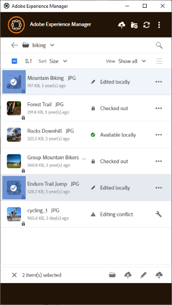
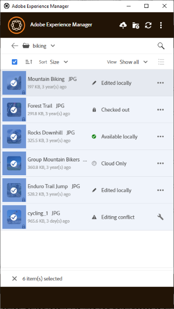

# Utiliser plusieurs ressources {#work-with-multiple-assets}

Les utilisateurs peuvent facilement utiliser et gérer plusieurs ressources à l’aide d’actions telles que le chargement de toutes les modifications en une seule fois ou le chargement de dossiers imbriqués en quelques clics.

## Parcourir les dossiers volumineux {#browse-large-folders}

Lorsque vous utilisez des dossiers contenant de nombreuses ressources, faites défiler l’écran pour afficher plus de ressources. Pour faire défiler à l’aide du clavier, appuyez plusieurs fois sur la touche de tabulation pour sélectionner la ressource en haut. La ressource sélectionnée est mise en surbrillance. À présent, utilisez la touche Flèche vers le bas pour vous déplacer dans la liste des ressources.

## Actions rapides pour les ressources sélectionnées {#quick-actions-for-selected-assets}

Cliquez sur la vignette de quelques ressources pour sélectionner ces ressources. Pour sélectionner toutes les ressources, cochez la case située dans la barre supérieure de l’application. L’ensemble des actions applicables à l’ensemble des ressources sélectionnées s’affiche dans une barre d’outils au bas de l’application.

Les actions disponibles dans la barre d’outils située en bas dépendent du statut des fichiers sélectionnés. Par exemple, si vous ne sélectionnez que des fichiers **[!UICONTROL Edited Locally]**, une icône **[!UICONTROL Upload Changes]** s’affiche. Si vous sélectionnez une combinaison de fichiers **[!UICONTROL Edited locally]** et **[!UICONTROL Cloud only]**, l’action **[!UICONTROL Upload Changes]** n’est pas disponible.

## Étapes suivantes {#next-steps}

* [Regardez une vidéo pour commencer à utiliser l’application de bureau Adobe Experience Manager .](https://experienceleague.adobe.com/en/docs/experience-manager-learn/assets/creative-workflows/aem-desktop-app)

* Faites des commentaires sur la documentation en utilisant [!UICONTROL Edit this page]  ou [!UICONTROL Log an issue]  disponible dans la barre latérale droite.

* Contacter l’[assistance clientèle](https://experienceleague.adobe.com/fr?support-solution=General#support)

>[!MORELIKETHIS]
>
>* [Chargement des ressources](/help/using/upload-assets.md)
>* [Télécharger des ressources](/help/using/download-assets.md)
>* [Recherche](/help/using/search.md)
